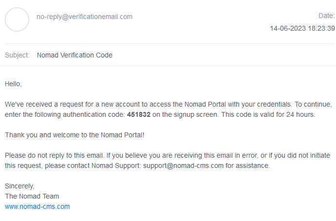

## Prerequisites

- Node package manager (npm).

> 📘 Note
> 
> You can download npm [here](https://nodejs.org/en/download).

## Nomad SDK NPM

To learn how to set up the nomad sdk npm, go to [Nomad SDK NPM](doc:nomad-sdk).

## Setup

To run the Node application, follow these steps:
```
npm install
npm start
```

Then open a webpage and go to localhost:4200.


## Nomad SDK Files

In the nomad-sdk/js directory there are two versions of the Nomad SDK. There is the sdk.min.js file which is a minified version of the sdk, and the sdk-debug.js file which is a concatenated version of the sdk. The sdk-debug file will show you all the parameter documentation and readable code.

## Login

To login, click the login button. (Note the NomadSDK automatically logs you in).


> 📘 Note
> 
> For more information about the API call used go to [Login](ref:login-1)

## Refresh Token

To refresh the authentication token, click the refresh token button. (Note the NomadSDK automatically refreshes the token before it expires).


> 📘 Note
> 
> For more information about the API call used go to [Refresh Token](ref:refresh)

## Forgot Password

If you forgot your password, enter your email under "Enter Username" under "Forgot Password". You should get emailed a 6 digit code.




> 📘 Note
> 
> For more information about the API call used go to [Forgot Password](ref:forgotpassword)

## Reset Password

Enter your code into "Enter Code" under "Reset Password" and your password will be reset.


> 📘 Note
> 
> For more information about the API call used go to [Reset Password](ref:resetpassword)

## Logout

To logout, click logout.


> 📘 Note
> 
> For more information about the API call used go to [Logout](ref:logout-1)