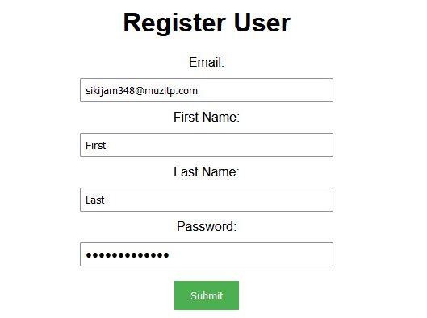
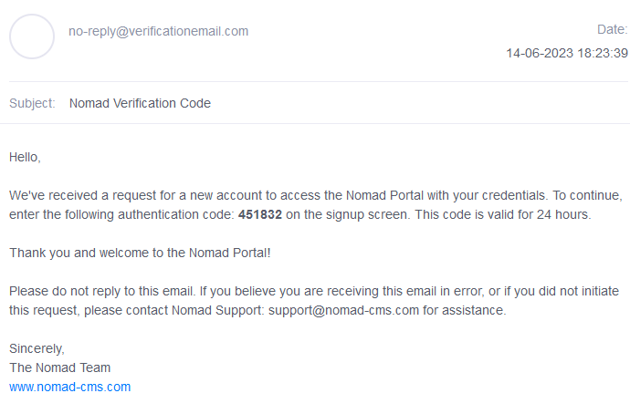
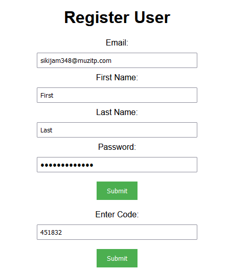
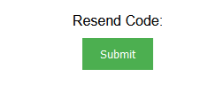
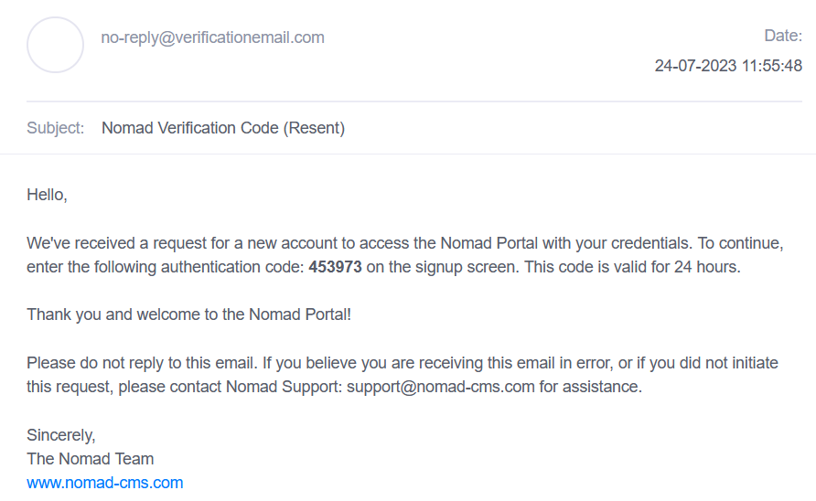

## Prerequisites

- Node package manager (npm).

> 📘 Note
> 
> You can download npm [here](https://nodejs.org/en/download).

## Nomad SDK NPM

To learn how to set up the nomad sdk npm, go to [Nomad SDK NPM](doc:nomad-sdk).

## Setup

To run the Node application, follow these steps:
```
npm install
npm start
```

Then open a webpage and go to localhost:4200.


## Nomad SDK Files

In the nomad-sdk/js directory there are two versions of the Nomad SDK. There is the sdk.min.js file which is a minified version of the sdk, and the sdk-debug.js file which is a concatenated version of the sdk. The sdk-debug file will show you all the parameter documentation and readable code.

## Register User

For the inputs, you first need to enter your email into "Email" and click the "Register" button. Check your email to see if you received a code from Nomad.



> 📘 Note
> 
> For more information about the API call used go to [Registers a user.](ref:register-1)

Type the code into the "Enter Code" and click "Submit". If done correctly, you should get a message in the console saying "Account now verified".


> 📘 Note
> 
> For more information about the API call used go to [Verifies a user.](ref:verify-1)

## Resend Code

If you didn't get an email with the code, push the resend code button. You will then get an email with a new code.



> 📘 Note
> 
> For more information about the API call used go to [Resends a code.](ref:resendcode)