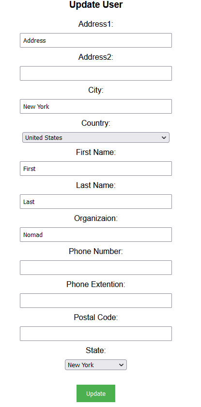
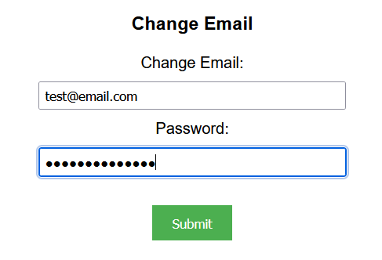
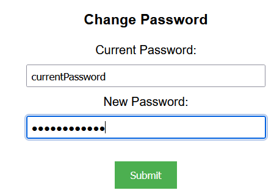

## Prerequisites

- Node package manager (npm).

> 📘 Note
> 
> You can download npm [here](https://nodejs.org/en/download).

## Nomad SDK NPM

To learn how to set up the nomad sdk npm, go to [Nomad SDK NPM](doc:nomad-sdk).

## Setup

To run the Node application, follow these steps:
```
npm install
npm start
```

Then open a webpage and go to localhost:4200.


## Nomad SDK Files

In the nomad-sdk/js directory there are two versions of the Nomad SDK. There is the sdk.min.js file which is a minified version of the sdk, and the sdk-debug.js file which is a concatenated version of the sdk. The sdk-debug file will show you all the parameter documentation and readable code.

## Update User

To update the user, enter the user information you want to update.


> 📘 Note
> 
> For more information about the API call used go to [Updates a user.](ref:updateuser)

## Change Email

To change your email, enter the new email you want to use under "Change Email" and click submit.


> 📘 Note
> 
> For more information about the API call used go to [Changes the email of a user.](ref:changeemail)

## Change Password

To change your password, enter the new password you want to use under "Change Password" and click submit.


> 📘 Note
> 
> For more information about the API call used go to [Changes the password of a user.](ref:changepassword)