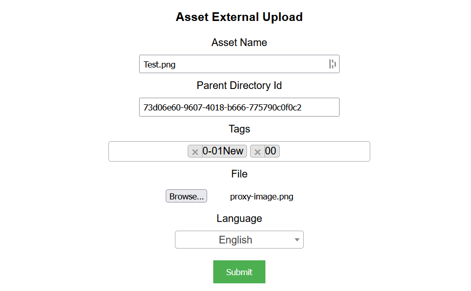

## Prerequisites

- Node package manager (npm).

> 📘 Note
> 
> You can download npm [here](https://nodejs.org/en/download).

## Nomad SDK NPM

To learn how to download and setup the nomad sdk npm, go to [Nomad SDK NPM](https://github.com/Nomad-Media/nomad-sdk/tree/main/nomad-sdk-npm).

## Setup

To run the Node application, follow these steps:
```
npm install
npm start
```

Then open a webpage and go to localhost:4200.

## Nomad SDK Files

In the nomad-sdk/js directory there are two versions of the Nomad SDK. There is the sdk.min.js file which is a minified version of the sdk, and the sdk-debug.js file which is a concatenated version of the sdk. The sdk-debug file will show you all the parameter documentation and readable code.

## Asset External Upload

To upload an asset externally, enter the name, with extension, of the asset you want to upload. Then enter the id of the parent directory you want to upload the asset to, the tags you want to add to the asset, the file you want to upload, and the language of the asset. Then click the `Submit` button.



> 📘 Note
>
> For more information on the API calls used go to [Upload Asset](https://developer.nomad-cms.com/docs/upload-asset-sdk) [Create Placeholder](https://developer.nomad-cms.com/docs/create-placeholder-asset) [Search](https://developer.nomad-cms.com/docs/search-api).