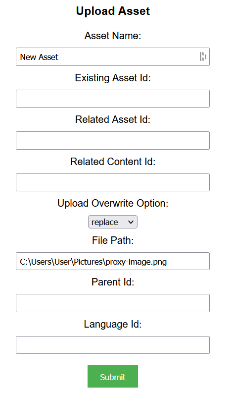
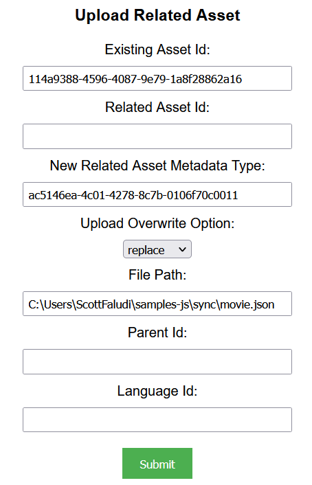

## Prerequisites

- Node package manager (npm).

> 📘 Note
> 
> You can download npm [here](https://nodejs.org/en/download).

## Nomad SDK NPM

To learn how to download and setup the nomad sdk npm, go to [Nomad SDK NPM](https://github.com/Nomad-Media/nomad-sdk/tree/main/nomad-sdk-npm).

## Setup

To run the Node application, follow these steps:
```
npm install
npm start
```

Then open a webpage and go to localhost:4200.

## Nomad SDK Files

In the nomad-sdk/js directory there are two versions of the Nomad SDK. There is the sdk.min.js file which is a minified version of the sdk, and the sdk-debug.js file which is a concatenated version of the sdk. The sdk-debug file will show you all the parameter documentation and readable code.

## Upload Asset

To upload an asset, Enter the Asset Name, Upload Overwrite Option, and the file path of the file you want to upload. Optionally, enter the existing asset id if you want to overwrite an existing asset, the id of the related asset/content you want to add to the asset, the id of the parent folder you want to add the asset to, and the id of the language you want to add the asset to.

 

> 📘 Note
> 
> For more information about the API call used go to [Asset Upload](https://developer.nomad-cms.com/reference/post_asset-upload-start)

## Upload Related Asset

To upload a related asset, enter the id of the asset you want to add the related asset to under existing asset id. Then enter the id of the asset metadata type, the upload overwrite option, and the file path of the file you want to upload. Optionally, enter the id of the related asset, the id of the parent folder you want to add the asset to, and the id of the language you want to add the asset to.



> 📘 Note
>
> For more information about the API call used go to [Asset Upload Related](https://developer.nomad-cms.com/reference/post_asset-upload-start-related-asset)