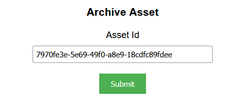
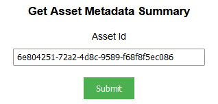

## Prerequisites

- Node package manager (npm).

> 📘 Note
> 
> You can download npm [here](https://nodejs.org/en/download).

## Nomad SDK NPM

To learn how to set up the nomad sdk npm, go to [Nomad SDK NPM](doc:nomad-sdk).

## Setup

To run the Node application, follow these steps:
```
npm install
npm start
```

Then open a webpage and go to localhost:4200.

## Nomad SDK Files

In the nomad-sdk/js directory there are two versions of the Nomad SDK. There is the sdk.min.js file which is a minified version of the sdk, and the sdk-debug.js file which is a concatenated version of the sdk. The sdk-debug file will show you all the parameter documentation and readable code.

## Archive Asset

To archive an asset, enter the id of the asset you want to archive.



> 📘 Note
> 
> For more information about the API call used got to [Archive Asset](doc:archive-asset)

## Clip Asset

To clip an asset, enter the id of the asset you want to clip, the start and end time codes, and the title. Optionally add the output folder id, the tags, the collections, the related contents, the video bitrate, and the audio tracks.


> 📘 Note
> 
> For more information about the API call used got to [Clip asset](ref:post_asset-id-clip)

## Copy Asset
To copy an asset, enter the id of the asset you want to copy and the id of the folder you want to copy the asset to under Destination Folder Id. Then optionally, enter the id and name of the batch action you want to add, the id of the content definition the asset is in, and the name of the schema.


> 📘 Note
>
> For more information about the API call used got to Copies an asset.

## Create Annotation

To create an annotation, enter the id of the asset you want to add the annotation to, the start time code, the country, the description, and the first and second keyword. If you want the annotation to be a clip instead of an image, enter an end time code. Optionally enter the content id and image url.


> 📘 Note
> 
> For more information about the API call used got to [Create Annotation](doc:create-annotation)

## Create Asset Ad Break

To create an asset ad break, enter the id of the asset you want to add the ad break to, the time code, and optionally, tag(s) and label(s).


> 📘 Note
> 
> For more information about the API call used got to [Create Asset Ad Break](doc:create-asset-ad-break)

## Create Folder Asset

To create a folder asset, enter the id of the parent folder you want the folder to be located in and the name of the folder.


> 📘 Note
> 
> For more information about the API call used got to [Create Folder Asset](doc:create-folder-asset)

## Create Placeholder Asset

To create a placeholder asset, enter the id of the parent folder you want the placeholder asset to be located in and the name of the asset. The name of the asset can contain spaces and special characters, but must include an extension.


> 📘 Note
> 
> For more information about the API call used got to [Create Placeholder Asset](doc:create-placeholder-asset)

## Create Screenshot At Timecode

To create a screenshot of a video asset at a timecode, enter the id of the asset you want to take a screenshot of and the timecode of when you want to take the screenshot.


> 📘 Note
> 
> For more information about the API call used got to [Create Screenshot At Timecode](doc:create-screenshot-at-timecode)

## Delete Annotation

To delete an annotation, enter the id of the asset the annotation is located in and the id of the annotation.


> 📘 Note
> 
> For more information about the API call used got to [Delete Annotation](doc:delete-annotation)

## Delete Asset

To delete an asset, enter the id of the asset you want to delete.


> 📘 Note
> 
> For more information about the API call used got to [Delete Asset](doc:delete-asset)

## Delete Asset Ad Break

To delete an asset ad break, enter the id of the asset the ad break is in, and the id of the ad break.


> 📘 Note
> 
> For more information about the API call used got to [Delete Asset Ad Break](doc:delete-asset-ad-break)

## Download Archive

To download an archive enter the id of the archive you want to download. If you are using the admin api url, you can also enter the name you want to assign the file and whether or not you want to download the archive as a proxy.


> 📘 Note
> 
> For more information about the API call used got to [Download Archive Asset](doc:download-archive-asset)

## Duplicate Asset

To duplicate an asset, enter the id of the asset you want to duplicate.


> 📘 Note
> 
> For more information about the API call used got to [Duplicate asset](ref:post_admin-asset-id-duplicate)

## Get Annotations

To get all the annotations of an asset, enter the id of the asset you want to get the annotations of.


> 📘 Note
> 
> For more information about the API call used got to [Get Annotations](doc:get-annotations)

## Get Asset

To get an asset, enter the id of the asset you want to get.


> 📘 Note
> 
> For more information about the API call used got to [Get Asset](doc:get-asset)

## Get Asset Ad Breaks

To get all asset ad breaks of an asset, enter the id of the asset you want to get the ad breaks of.


> 📘 Note
> 
> For more information about the API call used got to [Get Asset Ad Break](doc:get-asset-ad-break)

## Get Asset Details

To get the details of an asset, enter the id of the asset.


> 📘 Note
> 
> For more information about the API call used got to [Get Asset Details](doc:get-asset-details)

## Get Asset Manifest With Cookies

To get the asset manifest with cookies enter the id of the asset you want to get the manifest of and the id of the cookie.


> 📘 Note
> 
> For more information about the API call used got to [Get Asset Manifest With Cookies](doc:get-asset-manifest-with-cookies)

## Get Asset Metadata Summary

To get the summary of the metadata of an asset, enter the id of the asset.



> 📘 Note
> 
> For more information about the API call used got to [Get Asset Metadata Summary](doc:get-asset-metadata-summary)

## Get Asset Parent Folders

To get all of the parent folders of an asset, enter the id of the asset and the number of parent folders you want to show up in the results


> 📘 Note
> 
> For more information about the API call used got to [Get Asset Parent Folders](doc:get-asset-parent-folders)

## Get User Upload Parts

To get all of the parts of an upload, enter the id of the asset that was uploaded.


> 📘 Note
> 
> For more information about the API call used got to [Get User Upload Parts](doc:get-user-upload-parts)

## Get User Uploads

To get all of the uploads belonging to a user, enter whether or not you want the list to include completed uploads.


> 📘 Note
> 
> For more information about the API call used got to [Get User Uploads](doc:get-user-uploads)

## Import Annotations

To import annotations, enter the id of the asset you want to import the annotations to, the start time code of the annotation, and if you want the annotation to be of a clip instead of a frame, the end time code


> 📘 Note
> 
> For more information about the API call used got to [Import Annotation](doc:import-annotation)

## Index Asset

To index an asset, enter the id of the asset.


> 📘 Note
> 
> For more information about the API call used got to [Index Asset](doc:index-asset)

## Reprocess Asset

To reprocess asset(s), enter the id(s) of the asset(s).


> 📘 Note
> 
> For more information about the API call used got to [Reprocess Asset](doc:reprocess-asset)

## Restore Asset

To restore an asset, enter the id of the asset.


> 📘 Note
> 
> For more information about the API call used got to [Restore Asset](doc:restore-asset)

## Share Asset

To share an asset, enter the id of the asset you want to share, the nomad or external user id(s), and optionally, the number of hours you want to share the asset with the user(s).


> 📘 Note
> 
> For more information about the API call used got to [Share Asset](doc:share-asset)

## Start Workflow

To start a workflow, enter the action argument you want to use and the target id(s) you want to start the workflow of.


> 📘 Note
> 
> For more information about the API call used got to [Start Workflow](doc:start-workflow)

## Update Annotation

To update an annotation, enter the id of the asset you want to add the annotation to and the id of the annotation. Then enter the start time code, the country, the description, and the first and second keyword. If you want the annotation to be a clip instead of an image, enter an end time code. Optionally enter the content id and image url.


> 📘 Note
> 
> For more information about the API call used got to [Update Annotation](doc:update-annotation)

## Update Asset

To update an asset, enter the id of the asset you want to update. Then enter the display name, display date, available start date, available end date, and/or custom properties you wish to update.


> 📘 Note
>
> For more information about the API call used got to [Update Asset](doc:update-asset)

## Update Asset Ad Break

To update the ad break of an asset, enter the id of the asset, the id of the ad break, and the time code of the ad break if you want to update it. Then optionally enter the tags and labels you want to update.


> 📘 Note
> 
> For more information about the API call used got to [Update Asset Ad Break](doc:update-asset-ad-break)

## Update Asset Language

To update the language of an asset, enter the id of the asset and select the language you want to update the asset language to.


> 📘 Note
> 
> For more information about the API call used got to [Update Asset Language](doc:update-asset-language)