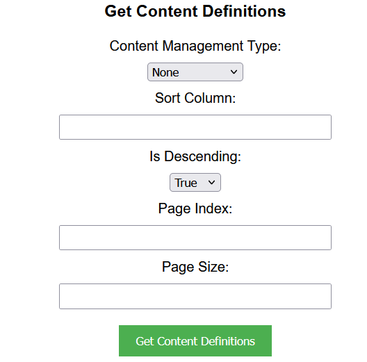
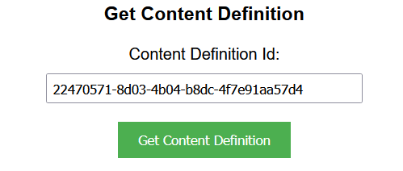

## Prerequisites

- Node package manager (npm).

> 📘 Note
> 
> You can download npm [here](https://nodejs.org/en/download).

## Nomad SDK NPM

To learn how to download and setup the nomad sdk npm, go to [Nomad SDK NPM](https://github.com/Nomad-Media/nomad-sdk/tree/main/nomad-sdk-npm).

## Setup

To run the Node application, follow these steps:
```
npm install
npm start
```

Then open a webpage and go to localhost:4200.

## Nomad SDK Files

In the nomad-sdk/js directory there are two versions of the Nomad SDK. There is the sdk.min.js file which is a minified version of the sdk, and the sdk-debug.js file which is a concatenated version of the sdk. The sdk-debug file will show you all the parameter documentation and readable code.

## Get Content Definitions

To get all content definitions, click `submit` to get all content definitions.



> 📘 Note
>
> For more information about the API call used go to [Get Content Definitions](https://developer.nomad-cms.com/docs/get-content-definitions)

## Get Content Definition

To get a content definition, enter the content definition id and click `submit`.



> 📘 Note
>
> For more information about the API call used go to [Get Content Definition](https://developer.nomad-cms.com/docs/get-content-definition)