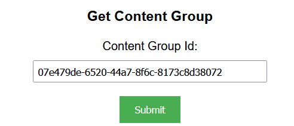
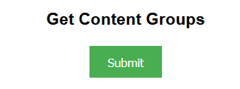
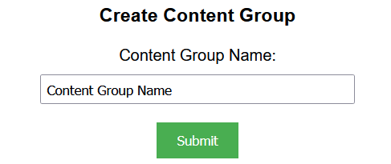
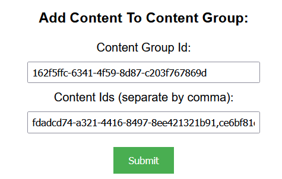
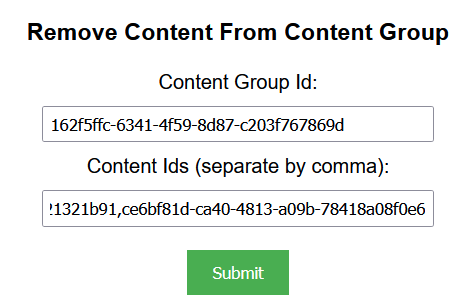
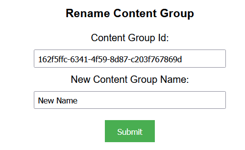
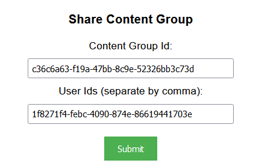
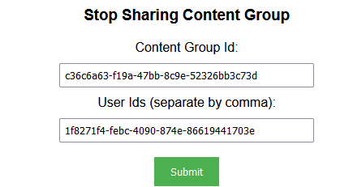
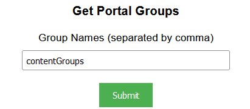
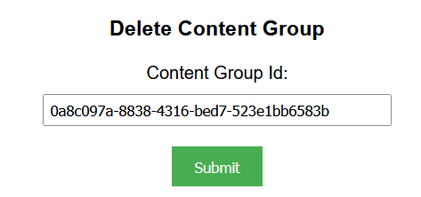

## Prerequisites

- Node package manager (npm).

> 📘 Note
> 
> You can download npm [here](https://nodejs.org/en/download).

## Nomad SDK NPM

To learn how to download and setup the nomad sdk npm, go to [Nomad SDK NPM](https://github.com/Nomad-Media/nomad-sdk/tree/main/nomad-sdk-npm).

## Setup

To run the Node application, follow these steps:
```
npm install
npm start
```

Then open a webpage and go to localhost:4200.

## Nomad SDK Files

In the nomad-sdk/js directory there are two version Of The Nomad SDK There is the sdk.min.js file which is a minified version of the sdk, and the sdk-debug.js file which is a concatenated version of the sdk. The sdk-debug file will show you all the parameter documentation and readable code.

## Get Content Group

To get a specific content group,  enter the content group id of the content group you want to get under Get Content Group . You can only see a content group if you are the owner, or have been shared the content group.



> 📘 Note
> 
> For more information about the API call used go to [Get Content Group](https://developer.nomad-cms.com/docs/get-content-group)

## Get Content Groups

To get all of the current asset groups, all you need to do is click the submit button under Get Asset Groups. Once you click submit, you will get a list of current asset groups.



> 📘 Note
> 
> For more information about the API call used go to [Get Content Groups](https://developer.nomad-cms.com/docs/get-content-groups)

## Create Content Group

To create a content group, enter a name. If you don't enter a name, the name will default to My Collection.



> 📘 Note
> 
> For more information about the API call used go to [Create Content Group](https://developer.nomad-cms.com/docs/create-content-group)

## Add Content To Content Group

To add content to your content group, enter the id of the content group you want to add the content to under Content Group Id. Then input the content ids of the assets you want to add to the asset group under Content Ids and click submit. Separate the values by a comma with no space after the comma.



> 📘 Note
> 
> For more information about the API call used go to [Add Content to Content Group](https://developer.nomad-cms.com/docs/add-content-to-content-group)

## Remove Content From Content Group

To remove content from your content group, enter the id of the content group you want to remove the assets from under Content Group Id. Then input the content id(s) of the content you want to remove from the content group under Content Ids and click submit. Separate the values by a comma with no space after the comma.



> 📘 Note
> 
> For more information about the API call used go to [Remove Content From Content Group](https://developer.nomad-cms.com/docs/remove-content-from-content-group)

## Rename Content Group

To rename your asset group, enter the id of the asset group you want to rename the assets from under "Asset Group Id:". Then enter the new name for the asset group and click submit.



> 📘 Note
> 
> For more information about the API call used go to [Rename Content Group](https://developer.nomad-cms.com/docs/rename-content-group)

## Share Content Group with Users

To share a content group with user(s), enter the id of the content group you want to share. Then enter the id(s) for the user(s) you want to share the content group with. Only the owner of the content group can share the content group with other users.



> 📘 Note
> 
> For more information about the API call used go to [Share Content Group](https://developer.nomad-cms.com/docs/share-content-group)

## Stop Sharing Content Group with Users

To stop sharing a content group with user(s), enter the id of the content group you want to stop sharing. Then enter the id(s) for the user(s) you want to stop sharing the content group with. Only the owner of the content group can stop sharing the content group with other users.



> 📘 Note
> 
> For more information about the API call used go to [Stop Sharing Content Group](https://developer.nomad-cms.com/docs/stop-sharing-content-group)

## Get Portal Groups

To get portal groups, enter the names of the portal group(s) you want to get. The portal groups are SavedSearches, ContentGroups and SharedContentGroups. You can only see portal groups that you own or that have been shared with you.



> 📘 Note
> 
> For more information about the API call used go to [Get Portal Groups](https://developer.nomad-cms.com/docs/get-portal-groups)

## Delete Content Group

To delete your content group, enter the id of the content group you want to delete under Content Group Id. Then click submit.



> 📘 Note
> 
> For more information about the API call used go to [Delete Content Group](https://developer.nomad-cms.com/docs/delete-content-group)