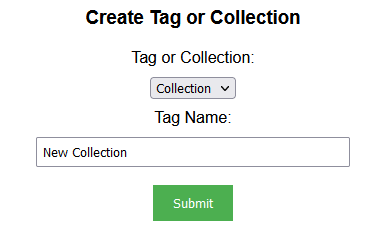
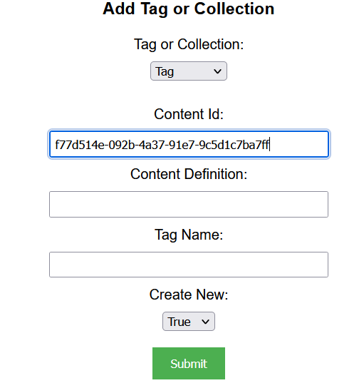
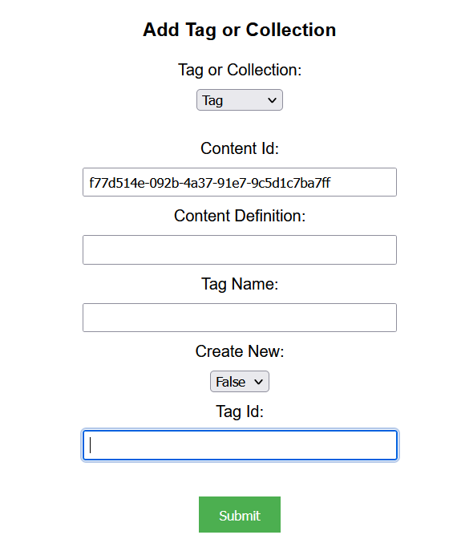
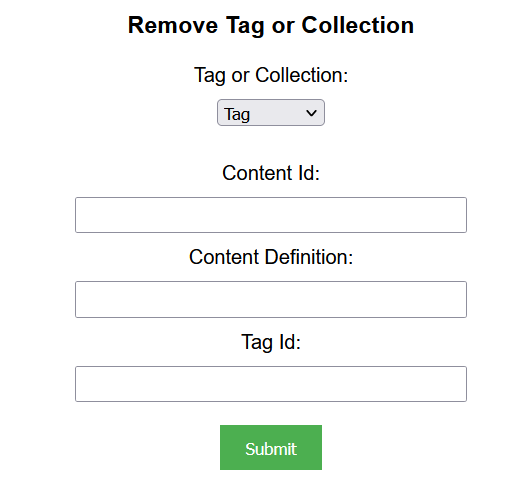
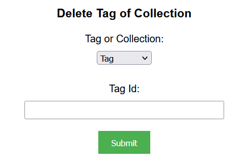
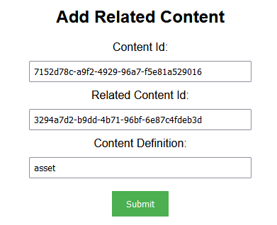
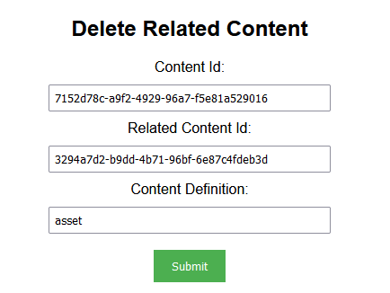
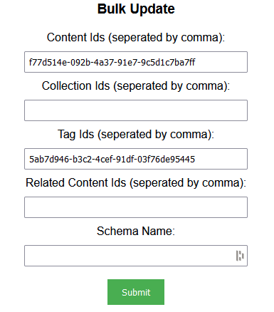
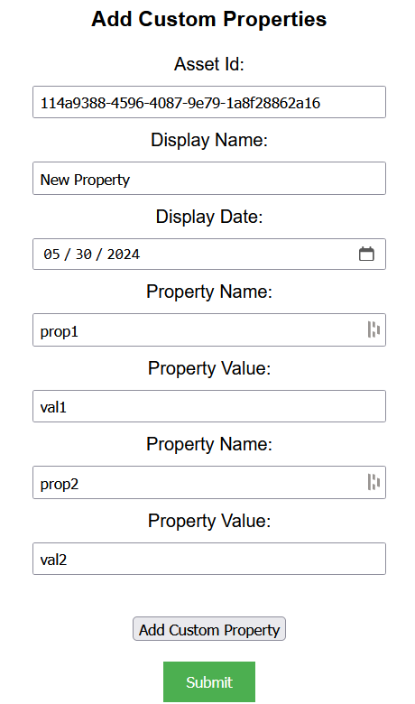

## Prerequisites

- Node package manager (npm).

> 📘 Note
> 
> You can download npm [here](https://nodejs.org/en/download).

## Nomad SDK NPM

To learn how to download and setup the nomad sdk npm, go to [Nomad SDK NPM](https://github.com/Nomad-Media/nomad-sdk/tree/main/nomad-sdk-npm).

## Setup

To run the Node application, follow these steps:
```
npm install
npm start
```

Then open a webpage and go to localhost:4200.

## Nomad SDK Files

In the nomad-sdk/js directory there are two versions of the Nomad SDK. There is the sdk.min.js file which is a minified version of the sdk, and the sdk-debug.js file which is a concatenated version of the sdk. The sdk-debug file will show you all the parameter documentation and readable code.

## Create Tag or Collection

To create a tag or collection, first choose from the Tag or Collection drop-down whether you want to add a tag or collection. Then enter the name of the tag or collection.



> 📘 Note
> 
> For more information about the API call used go to [Create Tag Or Collection](https://developer.nomad-cms.com/docs/create-tag-or-collection)

## Add Tag or Collection

To add a tag or collection to your image or video for your movie, first choose from the Tag or Collection drop-down whether you want to add a tag or collection. Then enter the content id of the asset you want to add, the content definition, and the name of the tag/collection. Then select if you want the tag or collection to be created or not under Create New. 



If you are using an existing tag or collection select false under Create New. Then enter the tag id of the tag you wish to add.



> 📘 Note
> 
> For more information about the API call used go to [Add Tag Or Collection](https://developer.nomad-cms.com/docs/add-tag-or-collection)

## Get Tag or Collection

To get a tag or collection, first choose from the Tag or Collection drop-down whether you want to add a tag or collection. Then enter the id of the tag or collection.


> 📘 Note
> 
> For more information about the API call user go to [Get Tag Or Collection](https://developer.nomad-cms.com/docs/get-tag-or-collection)

## Remove Tag or Collection

To remove a tag or collection from an asset, first enter whether you are removing a tag or collection. Then enter the content id, tag id, and the content definition of the tag or collection you want to remove.



> 📘 Note
> 
> For more information about the API call used go to [Remove Tag Or Collection](https://developer.nomad-cms.com/docs/remove-tag-or-collection)

## Delete Tag or Collection

To delete a tag or collection, first enter whether you are deleting a tag or collection. Then enter the tag id of the tag or collection you want to delete.



> 📘 Note
> 
> For more information about the API call used go to [Delete Tag Or Collection](https://developer.nomad-cms.com/docs/delete-tag-or-collection)

## Add Related Content

For this example we are going to add the image in our movie as the related content for the video in our movie. To do this, we are going to add the movie content id under Content Id and the image id under Related Content Id. Finally put asset for the Content Definition.



> 📘 Note
> 
> For more information about the API calls used go to [Add Related Content](https://developer.nomad-cms.com/docs/add-related-content)

## Delete Related Content

To delete the related content made in the example above, enter the content id of the movie under Content Id, the video id under the Related Content Id, and asset under Content Definition.



> 📘 Note
> 
> For more information about the API calls used go to [Delete Related Content](https://developer.nomad-cms.com/docs/delete-related-content)

## Bulk Update

To update metadata in bulk enter the id(s) of the content(s) you want to update. Then add the collection id(s), the related content id(s), and/or the tag id(s) you want to update.



> 📘 Note
> 
> For more information about the API call used go to [Bulk Update Metadata](https://developer.nomad-cms.com/docs/bulk-update-metadata)

## Add Custom Properties

To add custom properties to an asset, first enter the content id of the asset you want to add the custom properties to. Then enter the name and date of the custom property you want to add and the custom propteries. The properties will show up under `customAttributes` in the asset.



> 📘 Note
>
> For more information about the API call used go to [Add Custom Properties](https://developer.nomad-cms.com/docs/add-custom-properties)