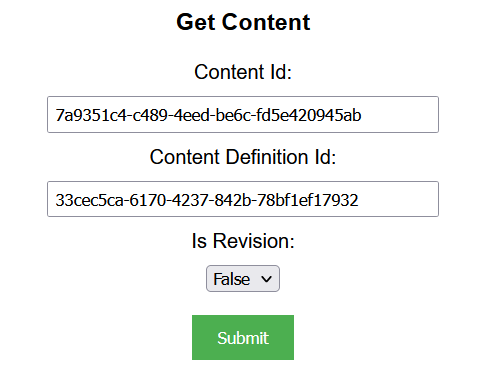
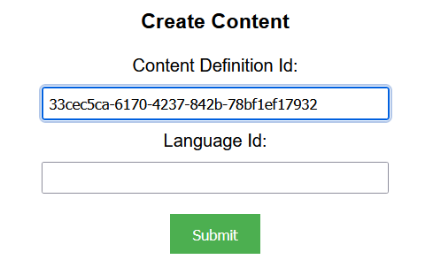
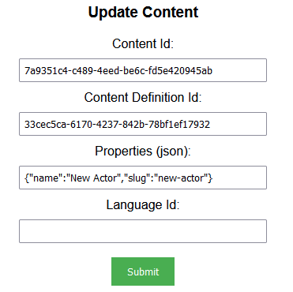
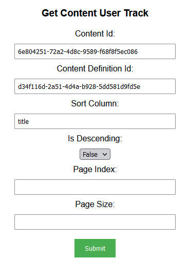
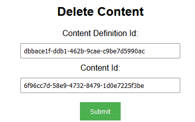

## Prerequisites

- Node package manager (npm).

> 📘 Note
> 
> You can download npm [here](https://nodejs.org/en/download).

## Nomad SDK NPM

To learn how to download and setup the nomad sdk npm, go to [Nomad SDK NPM](https://github.com/Nomad-Media/nomad-sdk/tree/main/nomad-sdk-npm).

## Setup

To run the Node application, follow these steps:
```
npm install
npm start
```

Then open a webpage and go to localhost:4200.

## Nomad SDK Files

In the nomad-sdk/js directory there are two versions of the Nomad SDK. There is the sdk.min.js file which is a minified version of the sdk, and the sdk-debug.js file which is a concatenated version of the sdk. The sdk-debug file will show you all the parameter documentation and readable code.

## Get Content

To get a content, enter the content and content definition id and if it is a revision.



> 📘 Note
> 
> For more information about the API call used go to [Get Content](https://developer.nomad-cms.com/docs/get-content)

## Create Content

To create content, enter the id of the content definition you want to add the content to. This will create a new blank content in your content definition.



> 📘 Note
> 
> For more information about the API call used go to [Create Content](https://developer.nomad-cms.com/docs/create-content)

## Update Content

To update content, enter the id of the content definition you want to update the content to, the id of the content you want to update, the properties (in json), and the language id.



> 📘 Note
> 
> For more information about the API call used go to [Update Content](https://developer.nomad-cms.com/docs/update-content)

## Get Content User Tracking

To get user tracking, enter the id and content definition id of the content you want to get the user tracking of.



> 📘 Note
> 
> For more information about the API call used go to [Gets Content User Track](https://developer.nomad-cms.com/docs/get-content-user-track)

## Delete Content

To delete content, enter the id of the content definition the content is in and the id of the content.



> 📘 Note
> 
> For more information about the API call used go to [Delete Content](https://developer.nomad-cms.com/docs/delete-content)