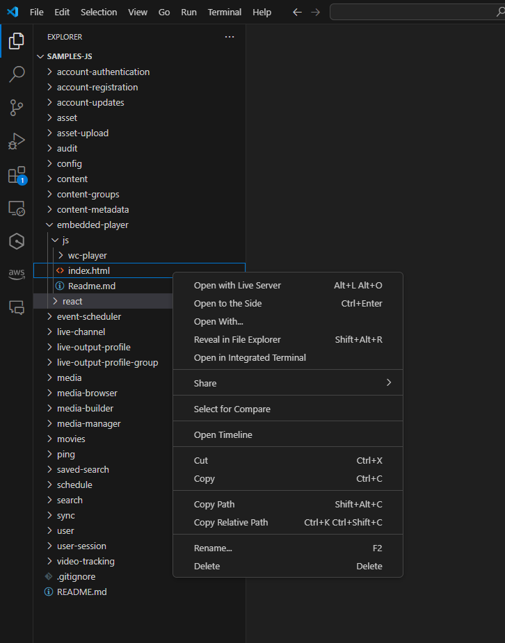
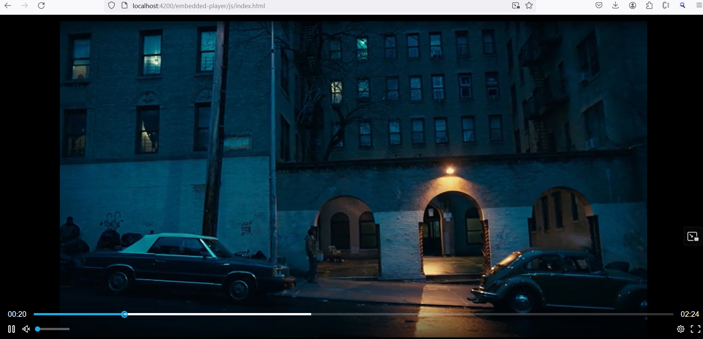

# How to run the existing js `wc-player`

## VS Code
To run the existing js `wc-player` in VS Code, follow these steps:
1. Right click on the `embedded-player/js/index.html` file and select `Open with Live Server`.



2. The browser will open with the player running.

## Terminal
To run the existing js `wc-player` in the terminal, follow these steps:
1. Navigate to the `embedded-player/js` directory.
2. Run the following commands:
```Shell 
npm install -g live-server
npx live-server --port=4200
```


3. The browser will open with the player running.

## Browser




