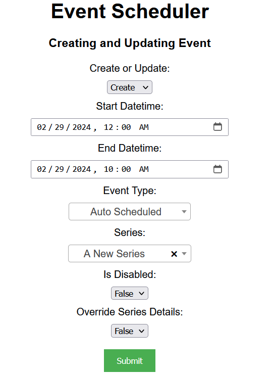
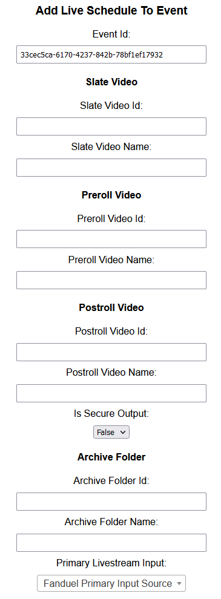
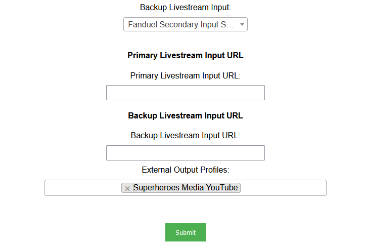
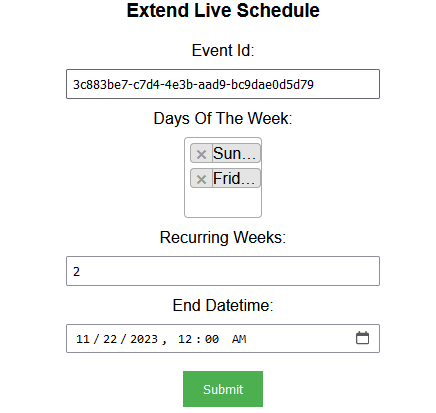
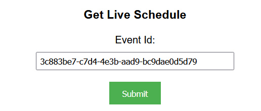
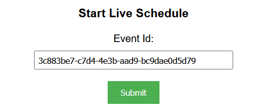
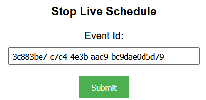
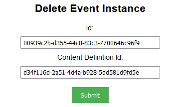

## Prerequisites

- Node package manager (npm).

> 📘 Note
> 
> You can download npm [here](https://nodejs.org/en/download).

## Nomad SDK NPM

To learn how to set up the nomad sdk npm, go to [Nomad SDK NPM](doc:nomad-sdk).

## Setup

To run the Node application, follow these steps:
```
npm install
npm start
```

Then open a webpage and go to localhost:4200.


## Nomad SDK Files

In the nomad-sdk/js directory there are two versions of the Nomad SDK. There is the sdk.min.js file which is a minified version of the sdk, and the sdk-debug.js file which is a concatenated version of the sdk. The sdk-debug file will show you all the parameter documentation and readable code.

## Create and Update Event Instance

To create or update an event, first select whether you want to create or update an event. Then enter the start and end datetime of the event, the event type, and optionally, the series and/or any additional properties.



> 📘 Note
> 
> For more information about the API calls used go to [Creates and updates an event.](ref:createandupdateevent)

## Add Live Schedule To Event

To add a live schedule to an event, you need to enter the id of the event you want to add the live schedule to. Either the Primary Livestream Input, or the Primary Livesteam Input URL is required.





> 📘 Note
> 
> For more information about the API calls used go to [Adds a live schedule to an event.](ref:addlivescheduletoevent)

## Extend Live Schedule

To extend a Live Schedule, you need to enter the id of the event with the live schedule, the days you want to extend it to, and the number of weeks you want to extend the live schedule to. Optionally, you can include the datetime in which you want to end the extension.



> 📘 Note
> 
> For more information about the API calls used go to [Extends a live schedule.](ref:extendliveschedule)

## Get Live Schedule

To get a live schedule of an event, you need to enter the id of the event.



> 📘 Note
> 
> For more information about the API calls used go to [Gets a live schedule.](ref:getliveschedule)

## Start Live Schedule

To start a live schedule of an event, you need to enter the id of the event.



> 📘 Note
> 
> For more information about the API calls used go to [Starts a live schedule.](ref:startliveschedule)

## Stop Live Schedule

To stop a live schedule of an event, you need to enter the id of the event.



> 📘 Note
> 
> For more information about the API calls used go to [Stops a live schedule.](ref:stopliveschedule)

## Deleting Event Instance

To delete an instance, you need the content id, and the content definition id.



> 📘 Note
> 
> For more information about the API calls used go to [Deletes an event.](ref:deleteevent)