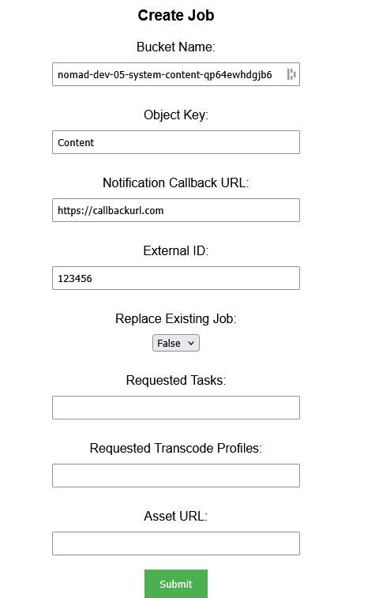
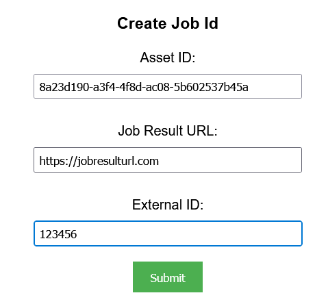

## Prerequisites

- Node package manager (npm).

> 📘 Note
> 
> You can download npm [here](https://nodejs.org/en/download).

## Nomad SDK NPM

To learn how to download and setup the nomad sdk npm, go to [Nomad SDK NPM](https://github.com/Nomad-Media/nomad-sdk/tree/main/nomad-sdk-npm).

## Setup

To run the Node application, follow these steps:
```
npm install
npm start
```

Then open a webpage and go to localhost:4200.

## Nomad SDK Files

In the nomad-sdk/js directory there are two versions of the Nomad SDK. There is the sdk.min.js file which is a minified version of the sdk, and the sdk-debug.js file which is a concatenated version of the sdk. The sdk-debug file will show you all the parameter documentation and readable code.

## Create Job

To create a job, enter the bucket name, object key, notification callback url, and external id of the job. Optionally, enter the asset url, requested tasks and requested transcode profile.



> 📘 Note
> 
> For more information about the API call used go to [Add Tag or Collection](https://developer.nomad-cms.com/docs/create-job)

## Create Job Id

To create a job for an asset, enter 2 when prompted. Then enter the asset id and job result url you want to assign to the job. Optionally, enter the external id.



> 📘 Note
> 
> For more information about the API call used go to [Add Tag or Collection](https://developer.nomad-cms.com/docs/create-job-id)