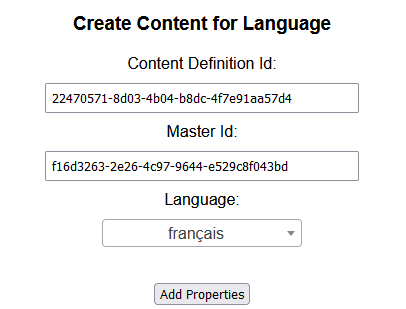
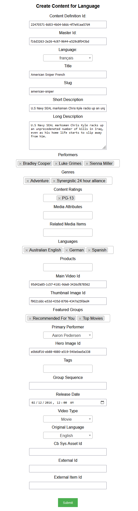
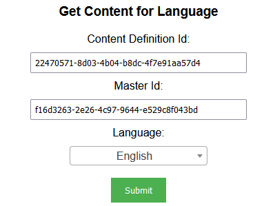
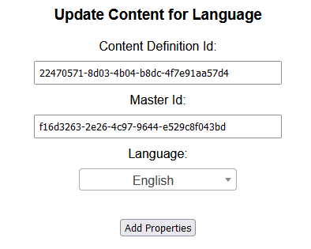
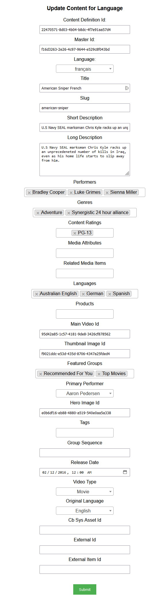
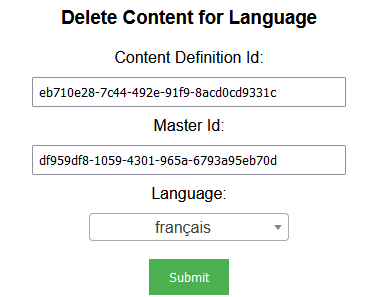

## Prerequisites

- Node package manager (npm).

> 📘 Note
> 
> You can download npm [here](https://nodejs.org/en/download).

## Nomad SDK NPM

To learn how to download and setup the nomad sdk npm, go to [Nomad SDK NPM](https://github.com/Nomad-Media/nomad-sdk/tree/main/nomad-sdk-npm).

## Setup

To run the Node application, follow these steps:
```
npm install
npm start
```

Then open a webpage and go to localhost:4200.

## Nomad SDK Files

In the nomad-sdk/js directory there are two versions of the Nomad SDK. There is the sdk.min.js file which is a minified version of the sdk, and the sdk-debug.js file which is a concatenated version of the sdk. The sdk-debug file will show you all the parameter documentation and readable code.

## Create Content for Language

To create content for a language, first enter the id for the content and the id of the content definition the content is in. Then select the language you want to create a version of the content for. Then click the `Add Properties` button.



When you click the `Add Properties` button, the properties for the content will appear with the values of the default language entered. You can change the values of the properties to the values you want for the new language. Once you have entered the values you want, click the `Submit` button at the bottom.



> 📘 Note
>
> For more information about the API calls used go to [Create Content](https://developer.nomad-cms.com/docs/create-content)

## Get Content for Language

To get content for a language, first enter the id for the content and the id of the content definition the content is in. Then select the language you want to get the content for. Then click the `Submit` button.



> 📘 Note
>
> For more information about the API calls used go to [Get Content](https://developer.nomad-cms.com/docs/get-content)


## Update Content for Language

To update content for a language, first enter the id for the content and the id of the content definition the content is in. Then select the language you want to update the content for. Then click the `Add Properties` button.



When you click the `Add Properties` button, the properties for the content will appear with the values of the default language entered. You can change the values of the properties to the values you want for the new language. Once you have entered the values you want, click the `Submit` button at the bottom.



> 📘 Note
>
> For more information about the API calls used go to [Update Content](https://developer.nomad-cms.com/docs/update-content)

## Delete Content for Language

To delete content for a language, first enter the id for the content and the id of the content definition the content is in. Then select the language you want to delete the content for. Then click the `Submit` button.



> 📘 Note
>
> For more information about the API calls used go to [Delete Content](https://developer.nomad-cms.com/docs/delete-content)