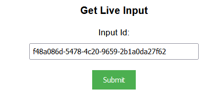
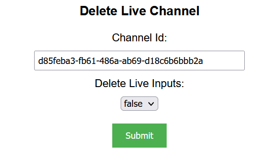

## Prerequisites

- Node package manager (npm).

> 📘 Note
> 
> You can download npm [here](https://nodejs.org/en/download).

## Nomad SDK NPM

To learn how to set up the nomad sdk npm, go to [Nomad SDK NPM](doc:nomad-sdk).

## Setup

To run the Node application, follow these steps:
```
npm install
npm start
```

Then open a webpage and go to localhost:4200.

## Nomad SDK Files

In the nomad-sdk/js directory there are two versions of the Nomad SDK. There is the sdk.min.js file which is a minified version of the sdk, and the sdk-debug.js file which is a concatenated version of the sdk. The sdk-debug file will show you all the parameter documentation and readable code.

## Get Live Channels

To get all live channels, click submit under Get Live Channels.


> 📘 Note
> 
> For more information about the API call used go to [Gets live channels.](ref:getlivechannels)

## Get Live Channel

To get a specific live channel, enter the id of the live channel you want to get.


> 📘 Note
> 
> For more information about the API call used go to [Gets a live channel.](ref:getlivechannel)

## Create Live Channel

To create a live channel, enter the channel name you want to assign the channel. Then enter all the information for the channel.


> 📘 Note
> 
> For more information about the API call used go to [Creates a live channel.](ref:createlivechannel)

## Update Channel

To update a live channel, enter the channel name , the id of the thumbnail image, and the asset id of the archive folder you want to update. Then enter the status of high availability, live clipping, secure output, and output screenshots you want to update. Finally choose the channel type you want to update to. If the channel type is external, you need to enter the url you want to use.


> 📘 Note
> 
> For more information about the API call used go to [Updates a live channel.](ref:updatelivechannel)

## Clip Live Channel

To clip a live channel, select the channel you want to clip. Then enter the start time code, and if you want the clip to be more than a frame, the end time code, and the id of the output folder asset. Optionally, add the title, tags, collections, related content, video bit rate, and audio tracks you want to add to the clip.


> 📘 Note
> 
> For more information about the API call used go to [Clips a live channel.](ref:cliplivechannel)

## Add Asset Schedule Event to Channel

To add an asset schedule event to a channel, enter the channel id you want to add the asset schedule event to and the asset id and name of the asset. If you set Is Loop to true, it will ignore the duration time code.


> 📘 Note
> 
> For more information about the API call used go to [Adds an asset schedule event.](ref:addassetscheduleevent)

## Get Asset Schedule Event

To get an asset schedule event, enter the channel id that the asset schedule event is in and the id of the schedule event.


> 📘 Note
> 
> For more information about the API call used go to [Gets an asset schedule event.](ref:getassetscheduleevent)

## Update Asset Schedule Event

To update an asset schedule event, enter the id of the schedule event, and the id of channel. Then enter the information you want to update.


> 📘 Note
> 
> For more information about the API call used go to [Updates an asset schedule event.](ref:updateassetscheduleevent)

## Remove Asset Schedule Event from Channel

To remove an asset schedule event from a live channel, enter the id of the channel and the id of the asset schedule event.


> 📘 Note
> 
> For more information about the API call used go to [Removes an asset schedule event.](ref:removeassetscheduleevent)

## Get Live Inputs

To get all live inputs, click submit under Get Live Inputs.


> 📘 Note
> 
> For more information about the API call used go to [Gets live inputs.](ref:getliveinputs)

## Get Live Input

To get a specific live input, enter the id of the input you want to get.



> 📘 Note
> 
> For more information about the API call used go to [Gets a live input.](ref:getliveinput)

## Create Live Input

To create a live input, enter the name you want to assign the input and choose the input type. If the input type is RTMP_PULL, RTP_PUSH, or URL_PULL, you will be asked for a source. If the input type is RTMP_PUSH, you will be asked for a source cidr.


> 📘 Note
> 
> For more information about the API call used go to [Creates a live input.](ref:createliveinput)

## Update Live Input

To update a live input, enter the id of the input you want to update. Then enter the name you want to update the input to and choose the input type you want to update to. If the input type is RTMP_PULL, RTP_PUSH, or URL_PULL, you will be asked for a source. If the input type is RTMP_PUSH, you will be asked for a source cidr.


> 📘 Note
> 
> For more information about the API call used go to [Updates a live input.](ref:updateliveinput)

## Start Channel

To start a live channel, enter the id of the channel you want to start.


> 📘 Note
> 
> For more information about the API call used go to [Starts a live channel.](ref:startlivechannel)

## Stop Channel

To stop a live channel, enter the id of the channel you want to stop.


> 📘 Note
> 
> For more information about the API call used go to [Stops a live channel.](ref:stoplivechannel)

## Add Live Input Schedule Event to Channel

To add a live input schedule event to a channel, enter the id of the channel you want to add the input to and the input id and name. Then, optionally, add the additional information needed.


> 📘 Note
> 
> For more information about the API call used go to [Adds an input schedule event.](ref:addinputscheduleevent)

## Get Live Input Schedule Event

To get a live input schedule event, enter the id of the channel that the schedule event is located in and the id of the schedule event.


> 📘 Note
> 
> For more information about the API call used go to [Gets an input schedule event.](ref:getinputscheduleevent)

## Update Live Input Schedule Event

To update a live input schedule event, enter the id of the channel that the schedule event is in and the id of the schedule event. Then enter the information you want to update.


> 📘 Note
> 
> For more information about the API call used go to [Updates an input schedule event.](ref:updateinputscheduleevent)

## Remove Live Input Schedule Event from Live Channel

To remove a live input from a live channel, enter the id of the channel that the schedule event is located in and the id of the schedule event.


> 📘 Note
> 
> For more information about the API call used go to [Removes an input schedule event.](ref:removeinputscheduleevent)

## Refresh Live Channels

To refresh the live channels, click the button under refresh live channels.


> 📘 Note
> 
> For more information about the API call used go to [Refresh Live Channels](ref:livechannelrefresh)

## Next Event

To get the next event of a live channel, enter the id of the channel you want the next event of.


> 📘 Note
> 
> For more information about the API call used go to [Gets the next event.](ref:nextevent)

## Start Output Tracking

To start tracking the output of a live channel, enter the id of the channel you want to track.


> 📘 Note
> 
> For more information about the API call used go to [Starts output tracking.](ref:startoutputtracking)

## Move Schedule Event

To move a schedule event, you need to enter the id of the channel the schedule event is in, the id of the schedule event, and the id of the schedule event you want to place the schedule event you want to move after.


> 📘 Note
> 
> For more information about the API call used go to [Moves a schedule event.](ref:movescheduleevent)

## Delete Live Channel

To delete a live channel, enter the id of the channel you want to delete and if you want to delete the inputs attached.



> 📘 Note
> 
> For more information about the API call used go to [Deletes a live channel.](ref:deletelivechannel)

## Delete Live Input

To delete a live input, enter the id of the input you want to delete.


> 📘 Note
> 
> For more information about the API call used go to [Deletes a live input.](ref:deleteliveinput)

## Get Live Output Profiles

To get all live output profiles, click submit under Get Live Outputs.


> 📘 Note
>
> For more information about the API call used go to [Gets live outputs.](ref:getliveoutputs)

## Get Live Output Profile

To get a specific live output profile, enter the id of the output you want to get.


> 📘 Note
>
> For more information about the API call used go to [Gets a live output.](ref:getliveoutput)

## Get Live Output Types

To get all live output types, click submit under Get Live Output Types.


> 📘 Note
>
> For more information about the API call used go to [Gets live output types.](ref:getliveoutputtypes)

## Create Live Output Profile

To create a live output profile, enter the name of the output, choose an output type, and select if the output is active or not. Then, optionally, fill in the rest of the information you want to add.


> 📘 Note
>
> For more information about the API call used go to [Creates a live output.](ref:createliveoutput)

## Update Live Output Profile

To update a live output profile, enter the id of the output you want to update. Then enter the name of the output, choose an output type, select if the output is active or not, and/or fill in the rest of the information you want to update.


> 📘 Note
>
> For more information about the API call used go to [Updates a live output.](ref:updateliveoutput)

## Delete Live Output Profile

To delete a live output profile, enter the id of the output you want to delete.


> 📘 Note
>
> For more information about the API call used go to [Deletes a live output.](ref:deleteliveoutput)

## Get Live Output Profile Groups

To get all live output profile groups, click submit under Get Live Output Profile Groups.


> 📘 Note
>
> For more information about the API call used go to [Gets live output profile groups.](ref:getliveoutputprofilegroups)

## Get Live Output Profile Group

To get a specific live output profile group, enter the id of the output profile group you want to get.


> 📘 Note
>
> For more information about the API call used go to [Gets a live output profile group.](ref:getliveoutputprofilegroup)

## Create Live Output Profile Group

To create a live output profile group, enter the name of the output profile group. Then select if the output profile group is enabled or not, the manifest type, whether or not to set the output profile group as the default, the live output type, optionally, the archive output profile, and the live output profile(s).


> 📘 Note
>
> For more information about the API call used go to [Creates a live output profile group.](ref:createliveoutputprofilegroup)

## Update Live Output Profile Group

To update a live output profile group, enter the id of the output profile group you want to update. Then enter the name, select if the output profile group is enabled or not, the manifest type, whether or not to set the output profile group as the default, the live output type, the archive output profile, and/or the live output profile(s) you want to update.


> 📘 Note
>
> For more information about the API call used go to [Updates a live output profile group.](ref:updateliveoutputprofilegroup)

## Delete Live Output Profile Group

To delete a live output profile group, enter the id of the output profile group you want to delete.


> 📘 Note
>
> For more information about the API call used go to [Deletes a live output profile group.](ref:deleteliveoutputprofilegroup)

## Get Live Operators

To get all live operators, click submit under Get Live Operators.


> 📘 Note
> 
> For more information about the API call used go to [Gets live operators.](ref:getliveoperators)

## Get Live Operator

To get a specific live operator, enter the id of the channel you want to get the live operator of.


> 📘 Note
> 
> For more information about the API call used go to [Gets a live operator.](ref:getliveoperator)

## Start Broadcast

To start a broadcast, enter the id of the channel you want to use for the broadcast. Then enter the preroll and postroll asset id, live input id, related content ids, and tag ids if you want to add them.


> 📘 Note
> 
> For more information about the API call used go to [Starts a broadcast.](ref:startbroadcast)

## Cancel Broadcast

To cancel a broadcast, enter the id of the channel associated with the broadcast.


> 📘 Note
> 
> For more information about the API call used go to [Cancels a Broadcast](ref:post_admin-liveoperator-liveoperatorid-cancel)

## Stop Broadcast

To stop a broadcast, enter the id of the channel associated with the broadcast.


> 📘 Note
> 
> For more information about the API call used go to [Stops a Broadcast](ref:post_admin-liveoperator-liveoperatorid-stop)

## Get Completed Segments

To get all completed segments, enter the id of the channel associated with the broadcast the segments are in.


> 📘 Note
> 
> For more information about the API call used go to [Gets complete segments.](ref:getcompletesegments)

## Start Segment

To start a segment, enter the id of the channel associated with the broadcast that you want to start the segment in.


> 📘 Note
> 
> For more information about the API call used go to [Starts a segment.](ref:startsegment)

## Cancel Segment

To cancel a segment, enter the id of the channel associated with the broadcast that you want to cancel the segment of.


> 📘 Note
> 
> For more information about the API call used go to [Cancels a segment.](ref:cancelsegment)

## Complete Segment

To complete a segment, enter the id of the channel. Then enter the ids of the related contents and tags you want to add to the segment.


> 📘 Note
> 
> For more information about the API call used go to [Completes a segment.](ref:completesegment)