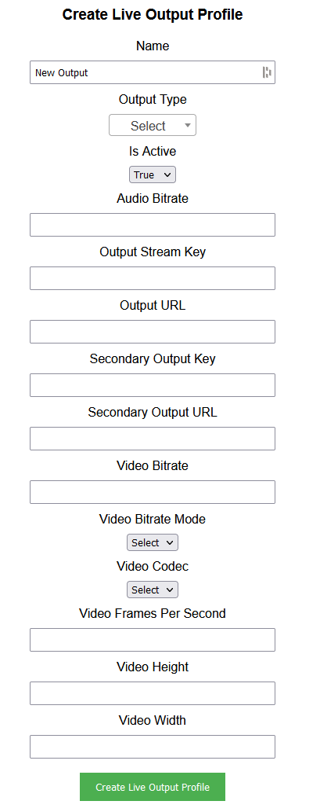

## Prerequisites

- Node package manager (npm).

> 📘 Note
> 
> You can download npm [here](https://nodejs.org/en/download).

## Nomad SDK NPM

To learn how to download and setup the nomad sdk npm, go to [Nomad SDK NPM](https://github.com/Nomad-Media/nomad-sdk/tree/main/nomad-sdk-npm).

## Setup

To run the Node application, follow these steps:
```
npm install
npm start
```

Then open a webpage and go to localhost:4200.

## Nomad SDK Files

In the nomad-sdk/js directory there are two versions of the Nomad SDK. There is the sdk.min.js file which is a minified version of the sdk, and the sdk-debug.js file which is a concatenated version of the sdk. The sdk-debug file will show you all the parameter documentation and readable code.

## Get Live Output Profiles

To get all live output profiles, click the button under the "Get Live Output Profiles" section.


> 📘 Note
> 
> For more information about the API call used go to [Get Live Output Profiles](https://developer.nomad-cms.com/docs/get-live-output-profiles)

## Get Live Output Profile

To get a specific live output profile, enter the live output profile id of the profile you want to get.


> 📘 Note
>
> For more information about the API call used go to [Get Live Output Profile](https://developer.nomad-cms.com/docs/get-live-output-profile)

## Get Live Output Types

To get all live output types, click the button under the "Get Live Output Types" section.


> 📘 Note
>
> For more information about the API call used go to [Get Live Output Types](https://developer.nomad-cms.com/docs/get-live-output-types)

## Create Live Output Profile

To create a live output profile, enter the name of the profile you want to create. Then enter the live output information you want to include in the profile.



> 📘 Note
>
> For more information about the API call used go to [Create Live Output Profile](https://developer.nomad-cms.com/docs/create-live-output-profile)

## Update Live Output Profile

To update a live output profile, enter the live output profile id of the profile you want to update. Then enter the live output information you want to update in the profile.


> 📘 Note
>
> For more information about the API call used go to [Update Live Output Profile](https://developer.nomad-cms.com/docs/update-live-output-profile)

## Delete Live Output Profile

To delete a live output profile, enter the live output profile id of the profile you want to delete.


> 📘 Note
>
> For more information about the API call used go to [Delete Live Output Profile](https://developer.nomad-cms.com/docs/delete-live-output-profile)