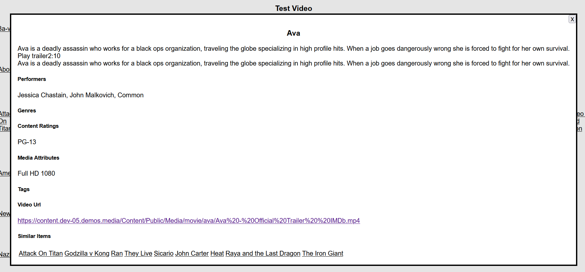

## Prerequisites

- Node package manager (npm).

> 📘 Note
> 
> You can download npm [here](https://nodejs.org/en/download).

## Nomad SDK NPM

To learn how to download and setup the nomad sdk npm, go to [Nomad SDK NPM](https://github.com/Nomad-Media/nomad-sdk/tree/main/nomad-sdk-npm).

## Setup

To run the Node application, follow these steps:
```
npm install
npm start
```

Then open a webpage and go to localhost:4200.

## Nomad SDK Files

In the nomad-sdk/js directory there are two versions of the Nomad SDK. There is the sdk.min.js file which is a minified version of the sdk, and the sdk-debug.js file which is a concatenated version of the sdk. The sdk-debug file will show you all the parameter documentation and readable code.

## Homepage

The homepage displays the media content in rows of featured groups where the featured group items are listed in alphabetical order with the name of the media group as the title. Click on the media content to view the details of the content. It also has navigation bars in the header and the footer of the page. Click on `Home` at the top lift of the top navigation bar to go back to the homepage from the other pages. To access the homepage, click on the `Get Config` button at the top of the page. Then click on the `Get Media Group` button to display the media group.


*Homepage*


*Media content*

> 📘 Note
>
> For more information on the API calls used go to [Get Default Site Config](https://developer.nomad-cms.com/docs/get-default-site-config) [Get Media Group](https://developer.nomad-cms.com/docs/get-media-group).

## Content Definitions

The content definition pages display the media content in rows of featured groups where the featured group items are listed in alphabetical order with the name of the media group as the title. Click on the media content to view the details of the content. The content pages can be found in the top navigation bar; their names are `Videos`, `Series`, `Events`, and `Genres`.


> 📘 Note
>
> For more information on the API calls used go to [Get Media Group](https://developer.nomad-cms.com/docs/get-media-group).

## Search

To search for a specific media content, click on the search link at the top right of the page. This will bring you to the search page where you can search for media content by entering a search term in the search bar and clicking the search button.


*Search bar*


*Search results*

> 📘 Note
>
> For more information on the API calls used go to [Media Search](https://developer.nomad-cms.com/docs/media-search).

## More Info

The `More Info` navigation bar item, located at the bottom of the page, will bring you to the `Who We Are` page of the official Nomad Media website.


## Other Navigation Bar Items

The other navigation bar items will pop up a dialog box with the the information of the item you clicked on.

