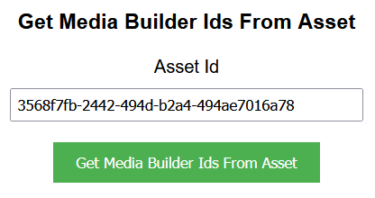

## Prerequisites

- Node package manager (npm).

> 📘 Note
> 
> You can download npm [here](https://nodejs.org/en/download).

## Nomad SDK NPM

To learn how to set up the nomad sdk npm, go to [Nomad SDK NPM](doc:nomad-sdk).

## Setup

To run the Node application, follow these steps:
```
npm install
npm start
```

Then open a webpage and go to localhost:4200.

## Nomad SDK Files

In the nomad-sdk/js directory there are two versions of the Nomad SDK. There is the sdk.min.js file which is a minified version of the sdk, and the sdk-debug.js file which is a concatenated version of the sdk. The sdk-debug file will show you all the parameter documentation and readable code.

## Create Media Builder

To create a media builder, enter the name you want to give the media builder. Optionally, you can add a destination folder id, collections, related content ids, and additional properties. Then click the "Create Media Builder" button.


> 📘 Note
>
> For more information on the API call used go to [Create Media Builder](https://developer.nomad-cms.com/reference/post_mediabuilder).

## Create Media Builder Item

To create a media builder item, enter the id of the media builder, and source asset, and optionally, the start or the start and end time code, or the id of the annotation you want to add to the media builder item. Optionally, you can also add related contents. Then click the "Create Media Builder Item" button.


> 📘 Note
>
> For more information on the API call used go to [Create Media Builder Item](https://developer.nomad-cms.com/reference/post_mediabuilder-mediabuilderid-items).

## Create Media Builder Items Add Annotations

To create media builder items from an asset using its annotations, enter the id of the media builder and source asset. Then click the "Create Media Builder Items Add Annotations" button.


> 📘 Note
>
> For more information on the API call used go to [Create Media Builder Item Add Annotations](https://developer.nomad-cms.com/reference/post_mediabuilder-mediabuilderid-items-sourceassetid-add-annotations).

## Create Media Builder Items Bulk

To create media builder items in bulk, enter the id of the media builder. Then add the source asset id, start time code, and optionally the end time code of the first media builder item you want to create. Then, if you want to add more media builder items, click the "Add Media Builder Item" button and add the information for the next media builder item until you are done, then click the "Create Media Builder Items Bulk" button.


> 📘 Note
>
> For more information on the API call used go to [Create Media Builder Items Bulk](https://developer.nomad-cms.com/reference/post_mediabuilder-mediabuilderid-items-bulk).

## Delete Media Builder

To delete a media builder, enter the id of the media builder you want to delete. Then click the "Delete Media Builder" button.


> 📘 Note
>
> For more information on the API call used go to [Delete Media Builder](https://developer.nomad-cms.com/reference/delete_mediabuilder-mediabuilderid).

## Delete Media Builder Item

To delete a media builder item, enter the id of the media builder and the id of the media builder item you want to delete. Then click the "Delete Media Builder Item" button.


> 📘 Note
>
> For more information on the API call used go to [Delete Media Builder Item](https://developer.nomad-cms.com/reference/delete_mediabuilder-mediabuilderid-items-itemid).

## Duplicate Media Builder

To duplicate a media builder, enter the id of the media builder you want to duplicate and the name you want to give to the duplicated media builder. Optionally, you can also enter the id of the destination folder where you want the duplicated media builder to be created and the collections, related contents, and properties you want to add to the duplicated media builder. Then click the "Duplicate Media Builder" button.


> 📘 Note
>
> For more information on the API call used go to [Duplicate Media Builder](https://developer.nomad-cms.com/reference/post_mediabuilder-mediabuilderid-duplicate).

## Get Media Builder

To get a media builder, enter the id of the media builder you want to get. Then click the "Get Media Builder" button.


> 📘 Note
>
> For more information on the API call used go to [Get Media Builder](https://developer.nomad-cms.com/reference/get_mediabuilder-mediabuilderid).

## Get Media Builders

To get all media builders, click the "Get Media Builders" button.


> 📘 Note
>
> For more information on the API call used go to [Get Media Builders](https://developer.nomad-cms.com/reference/get_mediabuilder).

## Get Media Builder Ids from an Asset

To get the media builder ids from an asset, enter the id of the asset you want to get the media builder ids from. Then click the "Get Media Builder Ids from an Asset" button.



> 📘 Note
>
> For more information on the API call used go to [Get Media Builder Ids from an asset](https://developer.nomad-cms.com/reference/get_mediabuilder-idsbysource-sourceassetid).

## Get Media Builder Items

To get all media builder items, enter the id of the media builder you want to get the media builder items from. Then click the "Get Media Builder Items" button.


> 📘 Note
>
> For more information on the API call used go to [Get Media Builder Items](https://developer.nomad-cms.com/reference/get_mediabuilder-mediabuilderid-items).

## Move Media Builder Item

To move media builder item within a media builder, enter the id of the media builder, the id of the media builder item you want to move, and optionally, the id of the media builder item you want to move the media builder item after. Then click the "Move Media Builder Items" button.


> 📘 Note
>
> For more information on the API call used go to [Move Media Builder Items](https://developer.nomad-cms.com/reference/post_mediabuilder-mediabuilderid-items-itemid-move).

## Render Media Builder

To render a media builder, enter the id of the media builder you want to render. Then click the "Render Media Builder" button.


> 📘 Note
>
> For more information on the API call used go to [Render Media Builder](https://developer.nomad-cms.com/reference/post_mediabuilder-mediabuilderid-render).

## Update Media Builder

To update a media builder, enter the id of the media builder you want to update. Then enter the name you want to give to the media builder, the destination folder id, collections, related content ids, and/or additional properties you want to update. Then click the "Update Media Builder" button.


> 📘 Note
>
> For more information on the API call used go to [Update Media Builder](https://developer.nomad-cms.com/reference/put_mediabuilder-mediabuilderid).