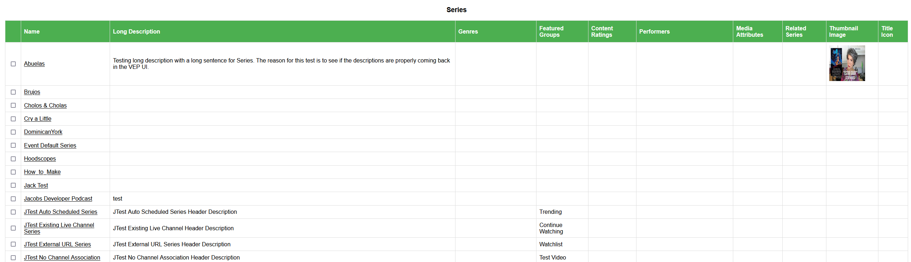
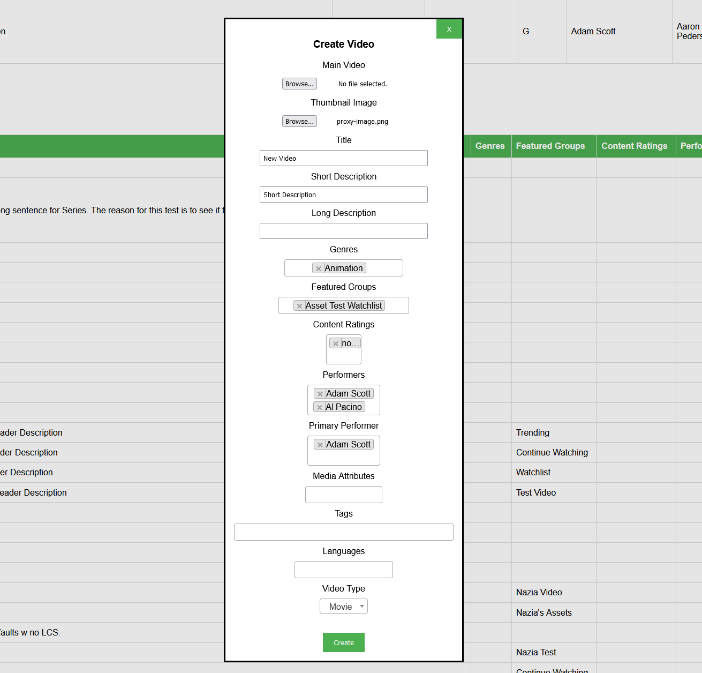
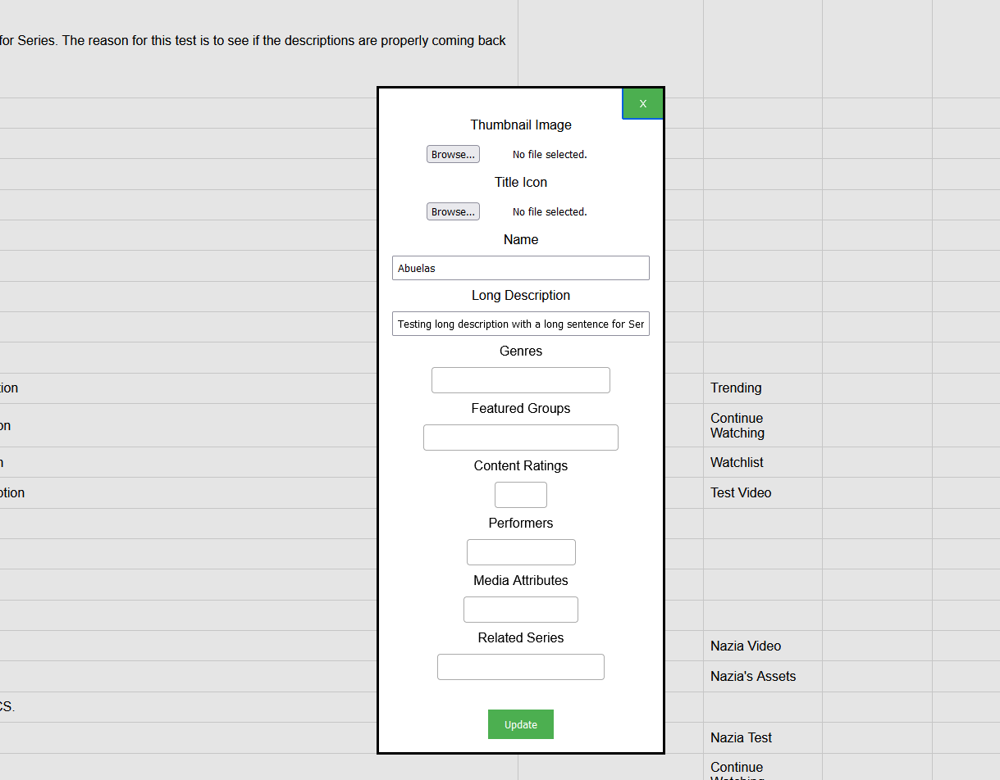
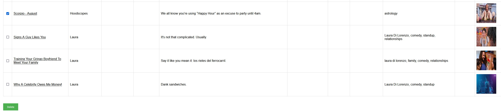

## Prerequisites

- Node package manager (npm).

> 📘 Note
> 
> You can download npm [here](https://nodejs.org/en/download).

## Nomad SDK NPM

To learn how to download and setup the nomad sdk npm, go to [Nomad SDK NPM](https://github.com/Nomad-Media/nomad-sdk/tree/main/nomad-sdk-npm).

## Setup

To run the Node application, follow these steps:
```
npm install
npm start
```

Then open a webpage and go to localhost:4200.

## Nomad SDK Files

In the nomad-sdk/js directory there are two versions of the Nomad SDK. There is the sdk.min.js file which is a minified version of the sdk, and the sdk-debug.js file which is a concatenated version of the sdk. The sdk-debug file will show you all the parameter documentation and readable code.

## Tables

There are tables for episodes, videos, and series. The tables contain information about the content and the thumbnail image.




## Create Episode

To create an episode, click on the `Create` button below the episode table. Then select the main video, thumbnail image, and enter the information for the episode in the fields below. Then click the `Upload` button.


> 📘 Note
>
> For more information on the API calls used go to [Create Episode](https://developer.nomad-cms.com/docs/create-content) [Upload Asset](https://developer.nomad-cms.com/docs/upload-asset-sdk).

## Create Video

To create a video, click on the `Create` button below the video table. Then select the main video, thumbnail image, and enter the information for the video in the fields below. Then click the `Upload` button.




> 📘 Note
>
> For more information on the API calls used go to [Create Video](https://developer.nomad-cms.com/docs/create-content) [Update Content](https://developer.nomad-cms.com/docs/update-content) [Upload Asset](https://developer.nomad-cms.com/docs/upload-asset-sdk).

## Create Series

To create a series, click on the `Create` button below the series table. Then select the thumbnail image, the title icon, and enter the information for the series in the fields below. Then click the `Upload` button. 


> 📘 Note
>
> For more information on the API call used go to [Create Series](https://developer.nomad-cms.com/docs/create-content) [Upload Asset](https://developer.nomad-cms.com/docs/upload-asset-sdk).

## Update Episode

To update an episode, click on the title of the episode you want to update. Then enter the information you want to update in the dialog box. Then click the `Update` button.


> 📘 Note
>
> For more information on the API call used go to [Update Episode](https://developer.nomad-cms.com/docs/update-content).

## Update Video

To update a video, click on the title of the video you want to update. Then enter the information you want to update in the dialog box. Then click the `Update` button.


> 📘 Note
>
> For more information on the API call used go to [Update Video](https://developer.nomad-cms.com/docs/update-content).

## Update Series

To update a series, click on the name of the series you want to update. Then enter the information you want to update in the dialog box. Then click the `Update` button.



> 📘 Note
>
> For more information on the API call used go to [Update Series](https://developer.nomad-cms.com/docs/update-content).

## Delete Episode

To delete episode(s), select the checkbox for the episode you want to delete. Then click the `Delete` button below the table.



> 📘 Note
>
> For more information on the API call used go to [Delete Episode](https://developer.nomad-cms.com/docs/delete-content).

## Delete Video

To delete video(s), select the checkbox for the video you want to delete. Then click the `Delete` button below the table.


> 📘 Note
>
> For more information on the API call used go to [Delete Video](https://developer.nomad-cms.com/docs/delete-content).

## Delete Series

To delete series(es), select the checkbox for the series you want to delete. Then click the `Delete` button below the table.


> 📘 Note
>
> For more information on the API call used go to [Delete Series](https://developer.nomad-cms.com/docs/delete-content).