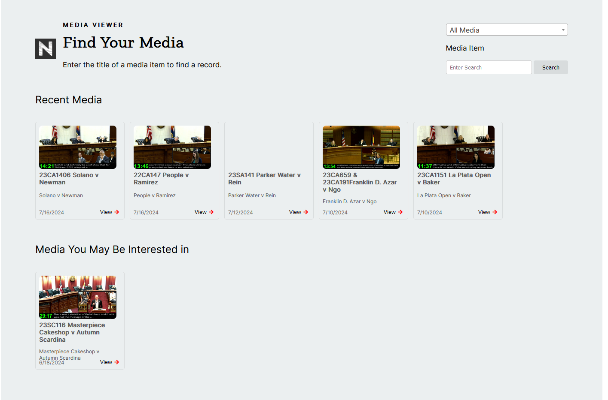
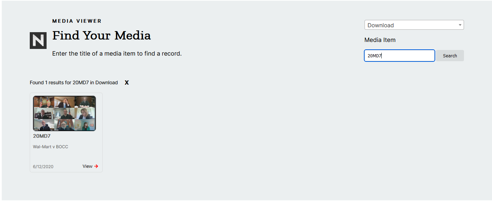

## Prerequisites

- Node package manager (npm).

> 📘 Note
> 
> You can download npm [here](https://nodejs.org/en/download).

## Nomad SDK NPM

To learn how to download and setup the nomad sdk npm, go to [Nomad SDK NPM](https://github.com/Nomad-Media/nomad-sdk/tree/main/nomad-sdk-npm). This sample uses the public version of the Nomad SDK.

## Setup

To run the Node application, follow these steps:
```
npm install
npm run start
```

Then open a webpage and go to localhost:4200.

## Nomad SDK Files

In the nomad-sdk/js directory there are two versions of the Nomad SDK. There is the sdk.min.js file which is a minified version of the sdk, and the sdk-debug.js file which is a concatenated version of the sdk. The sdk-debug file will show you all the parameter documentation and readable code.

## Homepage

The homepage contains a list of Recent Media, which contains the most recent asset display dates, and media you may be interested in, which contains the media set in the index js file.



## Filters

The filters allow you to filter the media by directory. The names and the ids of the directories are set in the index html file and can be changed to fit your needs.


## Search

The search bar allows you to search for media by title and will be filtered by the directory selected. If none are selected, it will search all directories. The number of results is shown above the results and the maximum number of results is 100.

