## Prerequisites

- Node package manager (npm).

> 📘 Note
> 
> You can download npm [here](https://nodejs.org/en/download).

## Nomad SDK NPM

To learn how to download and setup the nomad sdk npm, go to [Nomad SDK NPM](https://github.com/Nomad-Media/nomad-sdk/tree/main/nomad-sdk-npm).

## Setup

To run the Node application, follow these steps:
```
npm install
npm start
```

Then open a webpage and go to localhost:4200.

## Nomad SDK Files

In the nomad-sdk/js directory there are two versions of the Nomad SDK. There is the sdk.min.js file which is a minified version of the sdk, and the sdk-debug.js file which is a concatenated version of the sdk. The sdk-debug file will show you all the parameter documentation and readable code.

## Media Search

To search for media, use a search query and/or ids to filter the search. You can sort the fields of the result by entering you want the field you want to sort by and choosing ascending/descending to choose the order the sorted field gets sorted by.

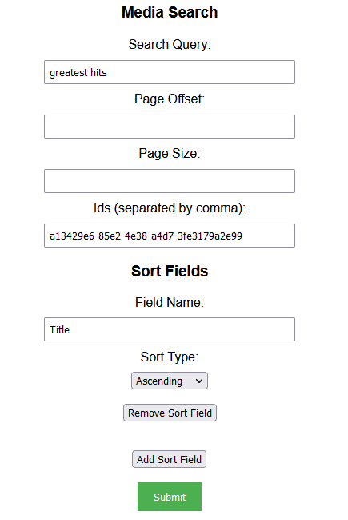

> 📘 Note
> 
> For more information about the API call used got to [Media Search](https://developer.nomad-cms.com/docs/media-search)

## Get Dynamic Content

To get a dynamic content, enter the id for the dynamic content record.

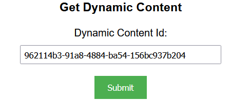

> 📘 Note
> 
> For more information about the API call used got to [Get Dynamic Content](https://developer.nomad-cms.com/docs/get-dynamic-content)

## Get Dynamic Contents

To get all dynamic contents, click submit under Get Dynamic Contents.

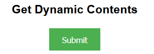

> 📘 Note
> 
> For more information about the API call used got to [Get Dynamic Contents](doc:get-dynamic-contents)

## Get Media Group

To get a media group, enter the id of the media group you want to get.

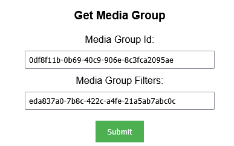

> 📘 Note
> 
> For more information about the API call used got to [Get Media Group](https://developer.nomad-cms.com/docs/get-media-group)

## Get Media Item

To get a media item, enter the id of the media item you want to get.

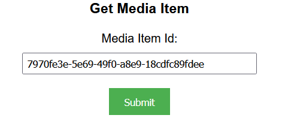

> 📘 Note
> 
> For more information about the API call used got to [Get Media Item](https://developer.nomad-cms.com/docs/get-media-item)

## Get Default Site Config

To get the default site config, click submit under Get Default Site Config.

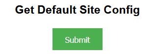

> 📘 Note
> 
> For more information about the API call used got to [Get Default Site Config](https://developer.nomad-cms.com/docs/get-default-site-config)

## Get Site Config

To get a site config, enter the id of the site config you want to generate.

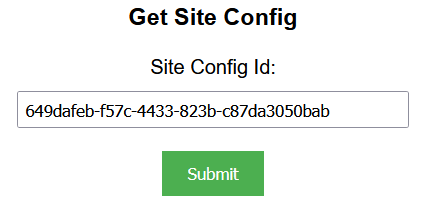

> 📘 Note
> 
> For more information about the API call used got to [Get Site Config](https://developer.nomad-cms.com/docs/get-site-config)

## Get My Content

To get the favorites and continue watching lists of IDs for the logged in user, click submit under Get My Content.

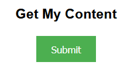

> 📘 Note
> 
> For more information about the API call used got to [Get My Content](https://developer.nomad-cms.com/docs/get-my-content)

## Get My Group

To get a user's group, enter the id of the group.

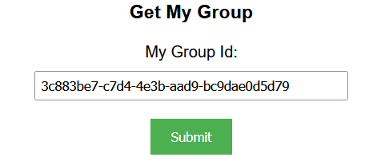

> 📘 Note
> 
> For more information about the API call used got to [Get My Group](https://developer.nomad-cms.com/docs/get-my-group)

## Clear Watchlist

To clear a user's watchlist, click submit under Clear Watchlist.

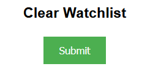

> 📘 Note
> 
> For more information about the API call used got to [Clear Watchlist](https://developer.nomad-cms.com/docs/clear-watchlist)

## Clear Continue Watching

To clear continue watching markers, enter the id of the user you want to clear the markers of and the id of the asset to clear the markers of. If no user Id is entered, it clears the markers of the logged in user. If not asset Id is entered, it clears all the markers.

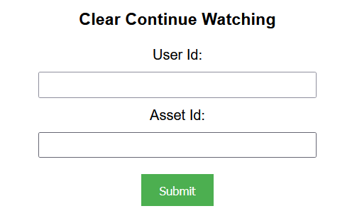

> 📘 Note
> 
> For more information about the API call used got to [Clear Continue Watching](https://developer.nomad-cms.com/docs/clear-continue-watching)

## Get Content Cookies

To get the cookies of a content, enter the id of the content you want to get the cookies of.

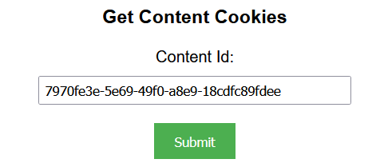

> 📘 Note
> 
> For more information about the API call used got to [Get Content Cookies](https://developer.nomad-cms.com/docs/get-content-cookies)

## Create Form

To create a form, you need the content definition id of the form, and the data you want to put in the form. For this example, the data is the first and last name, if its active, the start date, the lookup id, and the description of the form.

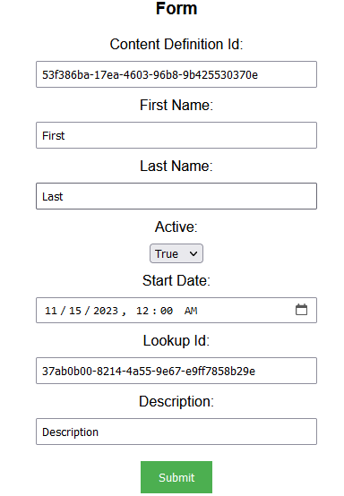

> 📘 Note
> 
> For more information about the API call used got to [Create Form](https://developer.nomad-cms.com/docs/create-form)