## Prerequisites

- Node package manager (npm).

> 📘 Note
> 
> You can download npm [here](https://nodejs.org/en/download).

## Nomad SDK NPM

To learn how to download and setup the nomad sdk npm, go to [Nomad SDK NPM](https://github.com/Nomad-Media/nomad-sdk/tree/main/nomad-sdk-npm).

## Setup

To run the Node application, follow these steps:
```
npm install
npm start
```

Then open a webpage and go to localhost:4200.

## Nomad SDK Files

In the nomad-sdk/js directory there are two versions of the Nomad SDK. There is the sdk.min.js file which is a minified version of the sdk, and the sdk-debug.js file which is a concatenated version of the sdk. The sdk-debug file will show you all the parameter documentation and readable code.

## Tabels

There are tables for episodes, videos, and series. The tables contain information about the contnet and the thumbnail image.

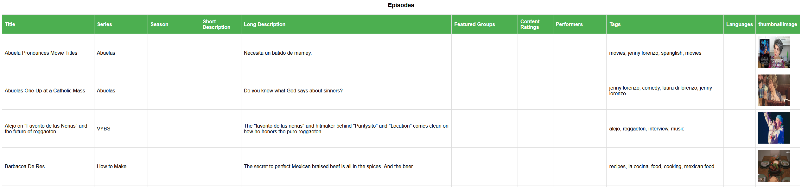

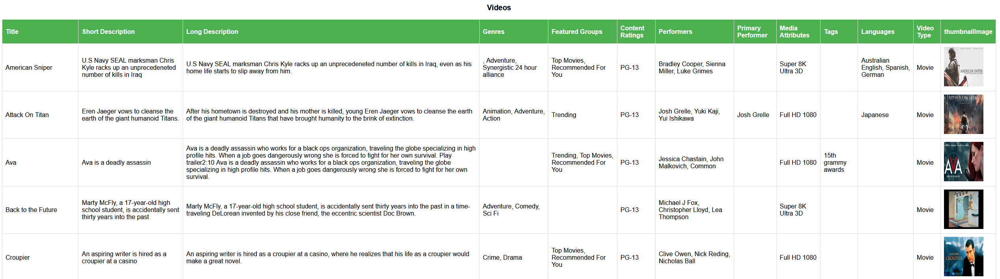

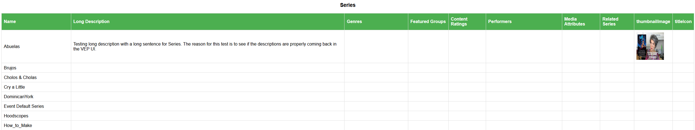

## Create Episode

To create an episode, select the main video and, optionally, the thumbnail image. Then select `episode` for the media type and enter the informattion for the episode in the fields below. Then click the `Upload` button.

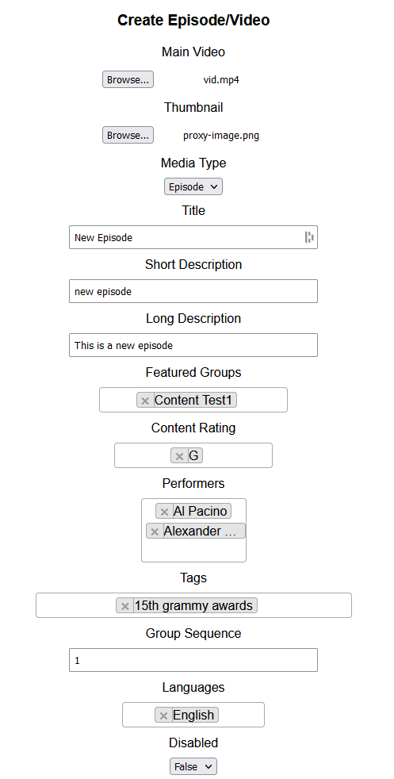

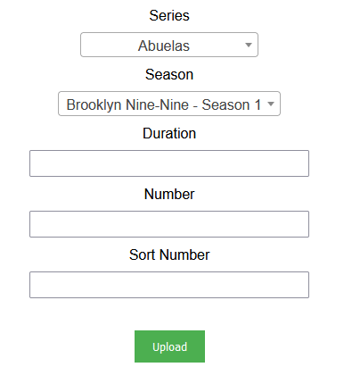

> 📘 Note
>
> For more information on the API calls used go to [Create Episode](https://developer.nomad-cms.com/docs/create-content) [Upload Asset](https://developer.nomad-cms.com/docs/upload-asset-sdk).

## Create Video

To create a video, select the main video and, optionally, the thumbnail image. Then select `video` for the media type and enter the informattion for the video in the fields below. Then click the `Upload` button.

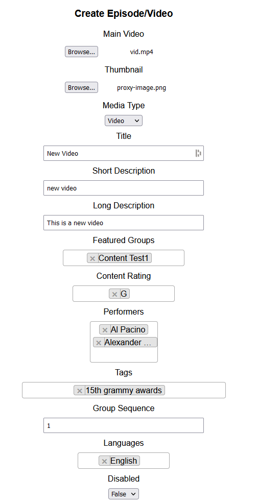

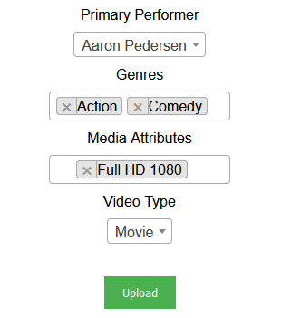

> 📘 Note
>
> For more information on the API calls used go to [Create Video](https://developer.nomad-cms.com/docs/create-content) [Update Content](https://developer.nomad-cms.com/docs/update-content) [Upload Asset](https://developer.nomad-cms.com/docs/upload-asset-sdk).

## Update Episode

To update an episode, select the episode you want to update. Then enter the information you want to update in the fields below. Then click the `Update` button.

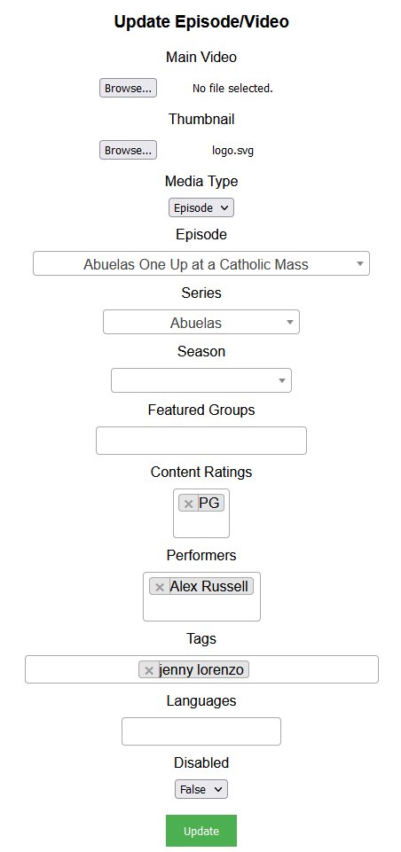

> 📘 Note
>
> For more information on the API call used go to [Update Episode](https://developer.nomad-cms.com/docs/update-content).

## Update Video

To update a video, select the video you want to update. Then enter the information you want to update in the fields below. Then click the `Update` button.

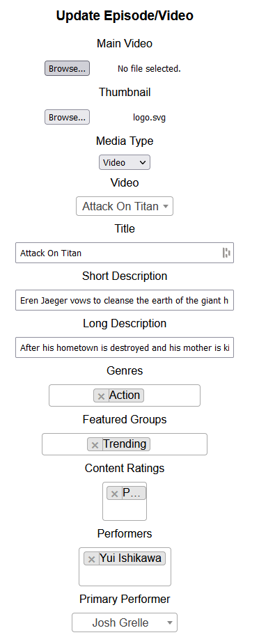

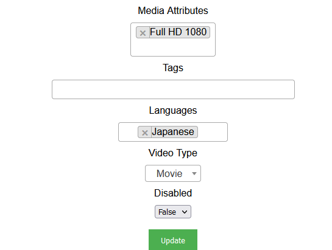

> 📘 Note
>
> For more information on the API call used go to [Update Video](https://developer.nomad-cms.com/docs/update-content).

## Delete Episode

To delete an episode, select the episode you want to delete. Then click the `Delete` button.

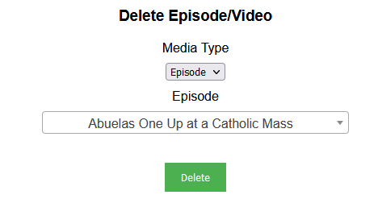

> 📘 Note
>
> For more information on the API call used go to [Delete Episode](https://developer.nomad-cms.com/docs/delete-content).

## Delete Video

To delete a video, select the video you want to delete. Then click the `Delete` button.

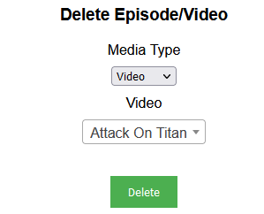

> 📘 Note
>
> For more information on the API call used go to [Delete Video](https://developer.nomad-cms.com/docs/delete-content).

## Create Series

To create a series, select the thumbnail image. Then select `series` for the media type and enter the informattion for the series in the fields below. Then click the `Create` button.

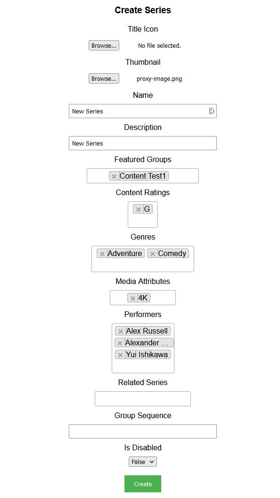

> 📘 Note
>
> For more information on the API call used go to [Create Series](https://developer.nomad-cms.com/docs/create-content).

## Update Series

To update a series, select the series you want to update. Then enter the information you want to update in the fields below. Then click the `Update` button.

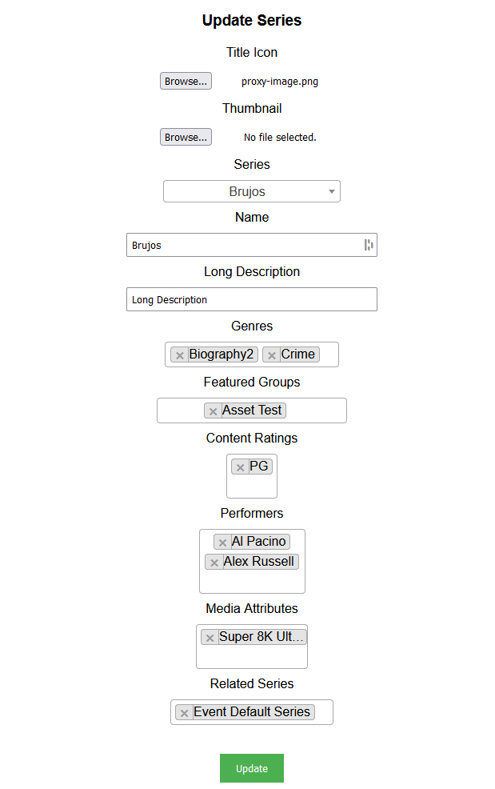

> 📘 Note
>
> For more information on the API call used go to [Update Series](https://developer.nomad-cms.com/docs/update-content).

## Delete Series

To delete a series, select the series you want to delete. Then click the `Delete` button.

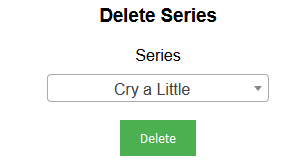

> 📘 Note
>
> For more information on the API call used go to [Delete Series](https://developer.nomad-cms.com/docs/delete-content).