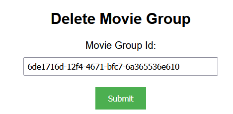

## Create Movie Group

To create a movie group, enter the name you want to name your content group and click submit.

> 📘 Note
> 
> For more information about the API call used got to [Creates a content group.](ref:createcontentgroup)

## Get Movie Groups

To get all of the movie, click submit under Get Movie Groups.

> 📘 Note
> 
> For more information about the API call used got to [Gets a content group.](ref:getcontentgroup)

## Get Movie Group

To get a movie group with a specific id, enter the group id under Movie Group Id and click submit.

> 📘 Note
> 
> For more information about the API call used got to [Gets content groups.](ref:getcontentgroups)

## Add Movie To Movie Group

To add a movie to a movie group, enter the movie group id you want to add the movie to under Movie Group Id. Then enter the movie id(s) you want to add to the movie group under Movie Ids. To enter more than one id, separate the ids by a comma (no space).

> 📘 Note
> 
> For more information about the API call used got to [Adds content to a content group.](ref:addcontenttocontentgroup)

## Remove Movie From Movie Group

To remove a movie to a movie group, enter the movie group id you want to remove the movie from under Movie Group Id. Then enter the movie id(s) you want to remove from the movie group under Movie Ids. To enter more than one id, separate the ids by a comma (no space).

> 📘 Note
> 
> For more information about the API call used got to [Removes contents from content group.](ref:removecontentsfromcontentgroups)

## Rename Movie Group

To rename a movie group, enter the id of the movie group and the new name you want to assign the movie group.

> 📘 Note
> 
> For more information about the API call used go to [Renames a content group.](ref:renamecontentgroup)

## Share Movie Group with User

To share a movie group with a user enter the movie group id of the movie group you want to share with the user and the user id of the user you want to share the movie with.

> 📘 Note
> 
> For more information about the API call used got to [Shares a content group.](ref:sharecontentgroup)

## Stop Sharing Movie Group with User

To stop sharing a movie group with a user enter the movie group id of the movie group you want to stop sharing with the user and the user id of the user you want to stop sharing the movie with.

> 📘 Note
> 
> For more information about the API calls used got to [Stops sharing a content group.](ref:stopsharingcontentgroup)

## Delete Movie Group

> 📘 Note
> 
> For more information about the API call used got to [Deletes a content group.](ref:deletecontentgroup)