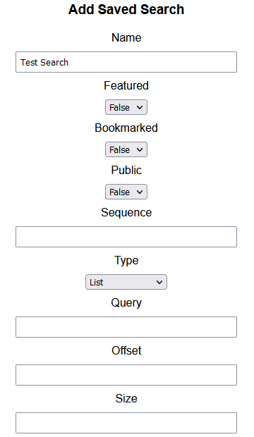
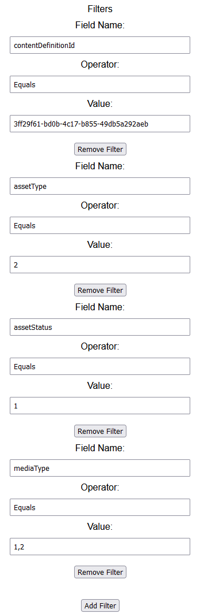
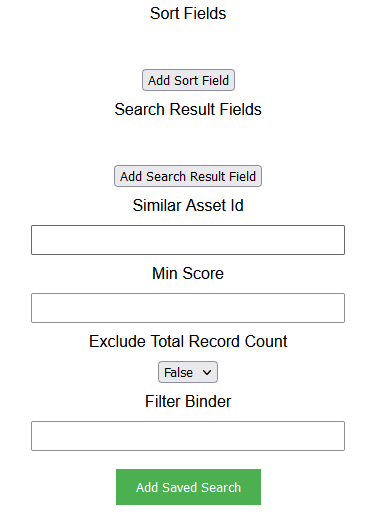
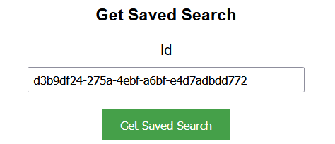
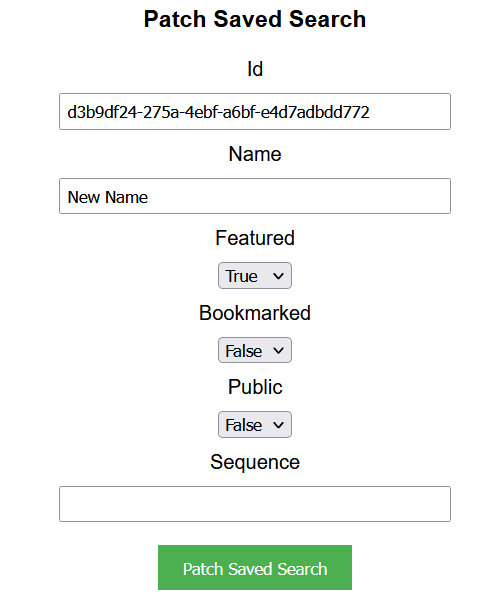
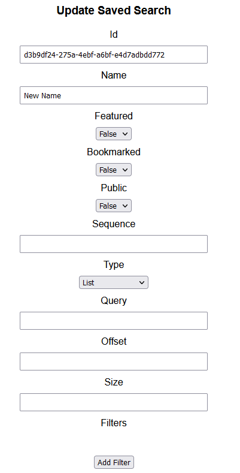
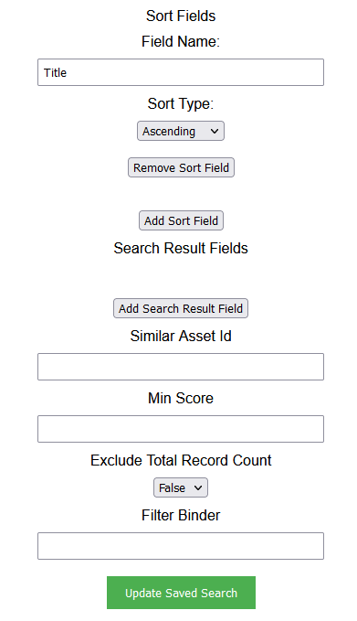
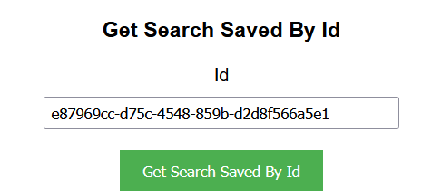

## Prerequisites

- Node package manager (npm).

> 📘 Note
> 
> You can download npm [here](https://nodejs.org/en/download).

## Nomad SDK NPM

To learn how to set up the nomad sdk npm, go to [Nomad SDK NPM](doc:nomad-sdk).

## Setup

To run the Node application, follow these steps:
```
npm install
npm start
```

Then open a webpage and go to localhost:4200.

## Nomad SDK Files

In the nomad-sdk/js directory there are two versions of the Nomad SDK. There is the sdk.min.js file which is a minified version of the sdk, and the sdk-debug.js file which is a concatenated version of the sdk. The sdk-debug file will show you all the parameter documentation and readable code.

## Add Saved Search

To add a saved search, enter the name you want to assign the saved search. Then enter the rest of the properties you want the saved search to have.







> 📘 Note
> 
> For more information about the API call used go to [Adds a saved search.](ref:addsavedsearch)

## Delete Saved Search

To delete a saved search, enter the id of the saved search you want to delete.


> 📘 Note
> 
> For more information about the API call used go to [Deletes a saved search.](ref:deletesavedsearch)

## Get Saved Search

To get a saved search, enter the id of the saved search you want to get.



> 📘 Note
> 
> For more information about the API call used go to [Gets a saved search.](ref:getsavedsearch)

## Get Saved Searches

To get all saved searches, click Get Saved Searches.


> 📘 Note
> 
> For more information about the API call used go to [Gets saved searches.](ref:getsavedsearches)

## Patch Saved Searches

To patch a saved search, enter the id of the saved search. Then enter the data you want to update.



> 📘 Note
> 
> For more information about the API call used go to [Patches a saved search.](ref:patchsavedsearch)

## Update Saved Search

To add a saved search, enter the id of the saved search you want to update. Then enter the rest of the properties you want the saved search to have.





> 📘 Note
> 
> For more information about the API call used go to [Updates a saved search.](ref:updatesavedsearch)

## Get Search Saved

To get a search saved, enter the information of the search saved that you are looking for.


> 📘 Note
> 
> For more information about the API call used go to [Gets search saved.](ref:getsearchsaved)

## Get Search Saved By Id

To get a search saved by id, enter the id to be searched.



> 📘 Note
> 
> For more information about the API call used go to [Get Search Saved By Id](doc:get-search-saved-by-id)