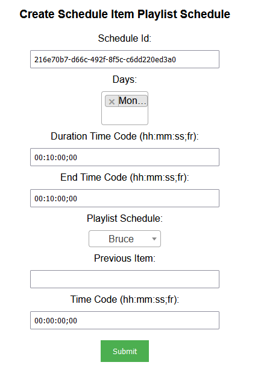
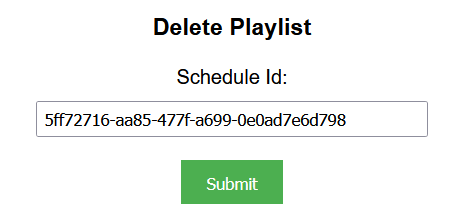

## Prerequisites

- Node package manager (npm).

> 📘 Note
> 
> You can download npm [here](https://nodejs.org/en/download).

## Nomad SDK NPM

To learn how to set up the nomad sdk npm, go to [Nomad SDK NPM](doc:nomad-sdk).

## Setup

To run the Node application, follow these steps:
```
npm install
npm start
```

Then open a webpage and go to localhost:4200.


## Nomad SDK Files

In the nomad-sdk/js directory there are two versions of the Nomad SDK. There is the sdk.min.js file which is a minified version of the sdk, and the sdk-debug.js file which is a concatenated version of the sdk. The sdk-debug file will show you all the parameter documentation and readable code.

## Create Intelligent Playlist

To create an intelligent playlist, you need to enter the end search and search duration of the intelligent playlist, the name of the intelligent playlist, the related contents of the playlists (based off of the content definition selected in the box above), the search filter type (if Random within a Date Range is chosen, you also need to add a Search Date and an End Search Date), and tag(s). Optionally, fill in the rest of the fields as needed.


> 📘 Note
> 
> For more information about the API call used got to [Create Intelligent Playlist](doc:create-intelligent-playlist)

## Create Intelligent Schedule

To create an intelligent schedule, you need to enter the default video asset id, name, and timezone. Then optionally, enter the id of the thumbnail asset.


> 📘 Note
> 
> For more information about the API call used got to [Create Intelligent Schedule](doc:create-intelligent-schedule)

## Create Playlist

To create a playlist, enter the name, whether or not to loop the playlist, and, optionally, the id of the thumbnail asset. If you set Loop Playlist to false, you need to enter the id of the default video asset.~~~~


> 📘 Note
> 
> For more information about the API call used got to [Create Playlist](doc:create-playlist)

## Create Playlist Video

To create a video in a playlist, enter the id of the playlist and the id of the asset of the video. Optionally, enter the id of playlist video you want to place it after.


> 📘 Note
> 
> For more information about the API call used got to [Create Playlist Video](doc:create-playlist-video)

## Create Schedule Item Asset

To create a schedule item asset, enter the id of the schedule you want to add the asset item to, the id of the asset, the days you want to add the asset item to, the start time code (time code) and the end time code of the asset, the duration from the start to end time code, and optionally, the id of the previous item.


> 📘 Note
> 
> For more information about the API call used got to [Create Schedule Item Asset](doc:create-schedule-item-asset)

## Create Schedule Item Live Channel

To create a schedule item live channel, enter the id of the schedule you want to add the live channel item to, the days you want to add the live channel to,  the start time code (time code) and the end time code of the asset, the duration from the start to end time code, the live channel, and optionally, the previous item.


> 📘 Note
> 
> For more information about the API call used got to [Create Schedule Item Live Channel](doc:create-schedule-item-live-channel)

## Create Schedule Item Search Filter

To create a schedule item search filter, enter the id of the schedule you want to add the search filter to, the days you want to add the search filter to, the start time code (time code) and the end time code of the asset, the duration from the start to end time code, the search and end search duration, the search filter type (if Random within a Date Range is chosen, you also need to add a Search Date and an End Search Date), and tag(s). Optionally, fill in the rest of the fields as needed.


> 📘 Note
> 
> For more information about the API call used got to [Create Schedule Item Search Filter](doc:create-schedule-item-search-filter)

## Create Schedule Item Playlist Schedule

To create a schedule item live channel, enter the id of the schedule you want to add the playlist schedule item to, the days you want to add the playlist schedule to,  the start time code (time code) and the end time code of the asset, the duration from the start to end time code, the playlist schedule, and optionally, the previous item.



> 📘 Note
> 
> For more information about the API call used got to [Create Schedule Item Playlist Schedule](doc:create-schedule-item-playlist-schedule)

## Delete Intelligent Playlist

To delete an intelligent playlist, enter the id of the intelligent playlist.


> 📘 Note
> 
> For more information about the API call used got to [Delete Intelligent Playlist](doc:delete-intelligent-playlist)

## Delete Intelligent Schedule

To delete an intelligent schedule, enter the id of the intelligent schedule.


> 📘 Note
> 
> For more information about the API call used got to [Delete Intelligent Schedule](doc:delete-intelligent-schedule)

## Delete Playlist

To delete a playlist, enter the id of the playlist.



> 📘 Note
> 
> For more information about the API call used got to [Delete Playlist](doc:delete-playlist)

## Delete Schedule Item

To delete an item in a schedule, enter the id of the schedule that the item is in and the id of the item.


> 📘 Note
> 
> For more information about the API call used got to [Delete Schedule Item](doc:delete-schedule-item)

## Get Intelligent Playlist

To get an intelligent playlist, enter the id of the intelligent playlist.


> 📘 Note
> 
> For more information about the API call used got to [Get Intelligent Playlist](doc:get-intelligent-playlist)

## Get Intelligent Schedule

To get an intelligent schedule, enter the id of the intelligent schedule.


> 📘 Note
> 
> For more information about the API call used got to [Get Intelligent Schedule](doc:get-intelligent-schedule)

## Get Playlist

To get a playlist, enter the id of the playlist.


> 📘 Note
> 
> For more information about the API call used got to [Get Playlist](doc:get-playlist)

## Get Schedule Item

To get a schedule item, enter the id of the schedule the item is in and the id of the item.


> 📘 Note
> 
> For more information about the API call used got to [Get Schedule Item](doc:get-schedule-item)

## Get Schedule Items

To get all the items for a schedule, enter the id of the schedule to get the items of.


> 📘 Note
> 
> For more information about the API call used got to [Get Schedule Items](doc:get-schedule-items)

## Get Schedule Preview

To get a schedule preview, enter the id of the schedule you want to preview.


> 📘 Note
> 
> For more information about the API call used got to [Get Schedule Preview](doc:get-schedule-preview)

## Move Schedule Item

To move a schedule item, enter the id of the schedule the item is in, the id of the item, and the id of the item you want to move the item after.


> 📘 Note
> 
> For more information about the API call used got to [Move Schedule Item](doc:move-schedule-item)

## Publish Intelligent Schedule

To publish an intelligent schedule, enter the id of the intelligent schedule and the number of days it is to be locked.


> 📘 Note
> 
> For more information about the API call used got to [Publish Intelligent Schedule](doc:publish-schedule)

## Start Schedule

To start a schedule, enter the id of the schedule and whether or not you want it to clean up on failure.


> 📘 Note
> 
> For more information about the API call used got to [Start Schedule](doc:start-schedule)

## Stop Schedule

To stop a schedule, enter the id of the schedule and whether or not you want to force the stop.


> 📘 Note
> 
> For more information about the API call used got to [Stop Schedule](doc:stop-schedule)

## Update Intelligent Playlist

To update an intelligent playlist, enter the schedule id of the intelligent playlist you want to update. Then enter the fields with the information you want to update.


> 📘 Note
> 
> For more information about the API call used got to [Update Intelligent Playlist](doc:update-intelligent-playlist)

## Update Intelligent Schedule

To update an intelligent schedule, you need to enter the id of the intelligent schedule. Then fill the fields of your choosing with the information you want to update.


> 📘 Note
> 
> For more information about the API call used got to [Update Intelligent Schedule](doc:update-intelligent-schedule)

## Update Playlist

To update a playlist, enter the id of the playlist. Then fill the fields of your choosing with the information you want to update. If you set Loop Playlist to false, you need to enter the id of the default video asset.


> 📘 Note
> 
> For more information about the API call used got to [Update Playlist](doc:update-playlist)

## Update Schedule Item Asset

To update a schedule item asset, enter the id of the schedule the item is located in and the id of the item. Then fill the fields with the information you want to update.


> 📘 Note
> 
> For more information about the API call used got to [Update Schedule Item Asset](doc:update-schedule-item-asset)

## Update Schedule Item Live Channel

To update a schedule item live channel, enter the id of the schedule the item is located in and the id of the item. Then fill the fields with the information you want to update.


> 📘 Note
> 
> For more information about the API call used got to [Update Schedule Item Live Channel](doc:update-schedule-item-live-channel)

## Update Schedule Item Search Filter

To update a schedule item search filter, enter the id of the schedule the item is located in and the id of the item. Then fill the fields with the information you want to update.


> 📘 Note
> 
> For more information about the API call used got to [Update Schedule Item Search Filter](doc:update-schedule-item-search-filter)

## Update Schedule Item Playlist Schedule

To update a schedule item playlist schedule, enter the id of the schedule the item is located in and the id of the item. Then fill the fields with the information you want to update.


> 📘 Note
> 
> For more information about the API call used got to [Update Schedule Item Playlist Schedule](doc:update-schedule-item-playlist-schedule)