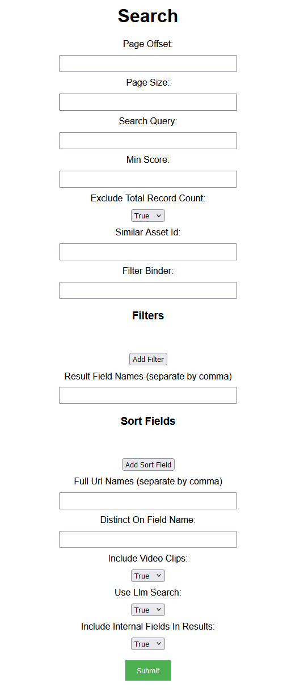

## Prerequisites

- Node package manager (npm).

> 📘 Note
> 
> You can download npm [here](https://nodejs.org/en/download).

## Nomad SDK NPM

To learn how to set up the nomad sdk npm, go to [Nomad SDK NPM](doc:nomad-sdk).

## Setup

To run the Node application, follow these steps:
```
npm install
npm start
```

Then open a webpage and go to localhost:4200.

## Nomad SDK Files

In the nomad-sdk/js directory there are two versions of the Nomad SDK. There is the sdk.min.js file which is a minified version of the sdk, and the sdk-debug.js file which is a concatenated version of the sdk. The sdk-debug file will show you all the parameter documentation and readable code.

## Search

To search, enter the info below.



When you click on add filters, you will see new text fields asking for the field name, operator, and value. If you want to remove the filter, click remove filter. You can add as many filters as you want.


When you click on add sort field, you will see new text fields asking for the field name and sort type. If you want to remove the sort field, click remove sort field. You can add as many sort fields as you want.


> 📘 Note
> 
> For more information about the API call used go to [Search](ref:search-2)