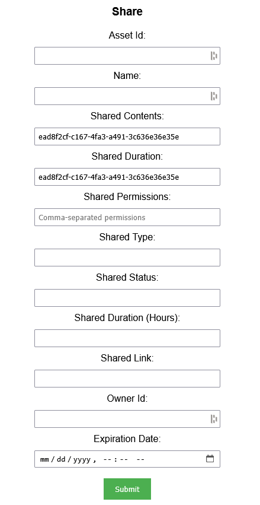
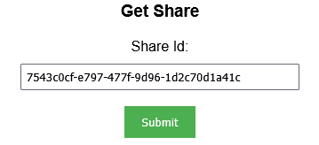
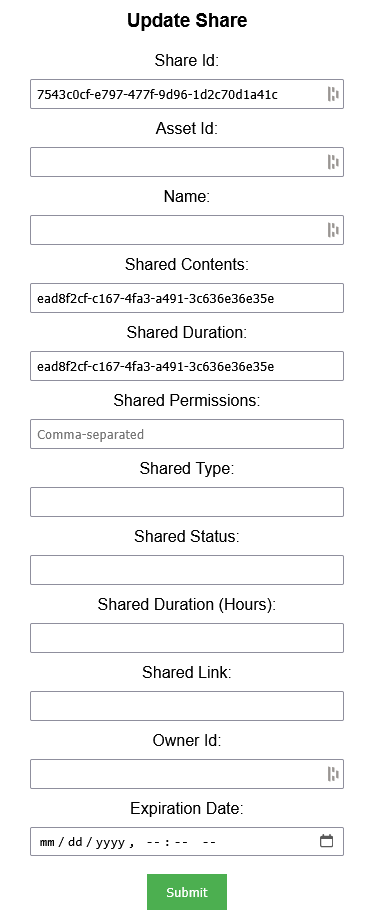
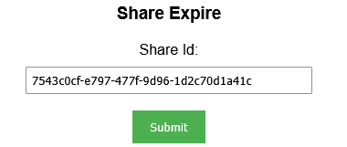
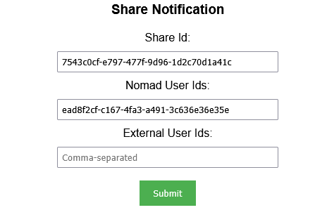
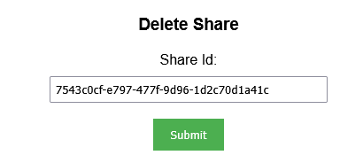

## Prerequisites

- Node package manager (npm).

> 📘 Note
> 
> You can download npm [here](https://nodejs.org/en/download).

## Nomad SDK NPM

To learn how to download and setup the nomad sdk npm, go to [Nomad SDK NPM](https://github.com/Nomad-Media/nomad-sdk/tree/main/nomad-sdk-npm).

## Setup

To run the Node application, follow these steps:
```
npm install
npm start
```

Then open a webpage and go to localhost:4200.

## Nomad SDK Files

In the nomad-sdk/js directory there are two versions of the Nomad SDK. There is the sdk.min.js file which i Minified Version Of the sdk, and the sdk-debug.js file which i Concatenated Version Of the sdk. The sdk-debug file will show you all the parameter documentation and readable code.

## Share

To share an asset, enter relevent information for your share into the fields and click `Submit`.



> 📘 Note
>
> For more information about the API call used, go to [Share](https://developer.nomad-cms.com/docs/share)

## Get Share

To get a share, enter the id of the share and click `Submit`.



> 📘 Note
>
> For more information about the API call used, go to [Get Share](https://developer.nomad-cms.com/docs/get-content)

## Update Share

To update a share, enter the id of the share into the first field. Then enter data into the fields you want to update and click `Submit`.



> 📘 Note
>
> For more information about the API call used, go to [Update Shate](https://developer.nomad-cms.com/docs/update-share)

## Share Expire

To expire a share, enter the id of the share and click `Submit`.



> 📘 Note
>
> For more information about the API call used, go to [Share Expire](https://developer.nomad-cms.com/docs/share-expire)

## Share Notification

To get the notifications for a sahre, enter the id of the share and the id(s) of the nomad users and/or external users and click `Submit`.



> 📘 Note
>
> For more information about the API call used, go to [Share Notification](https://developer.nomad-cms.com/docs/share-notification)

## Delete Share

To delete a share, enter the id of the share and click `Submit`.



> 📘 Note
>
> For more information about the API call used, go to [Delete Share](https://developer.nomad-cms.com/docs/delete-share)