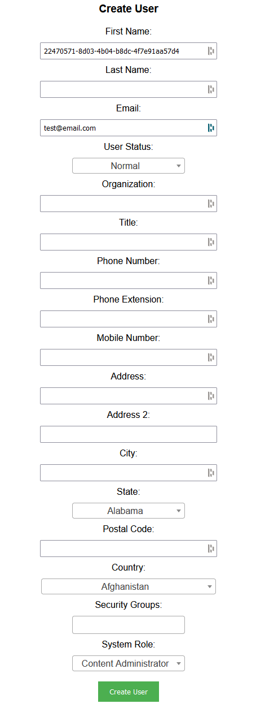
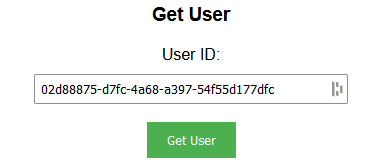
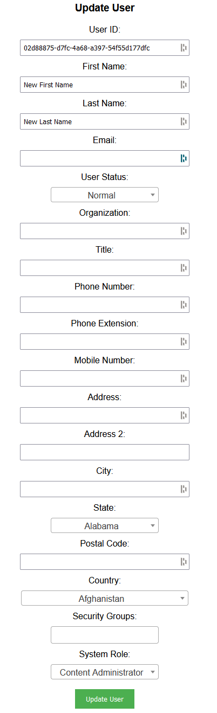
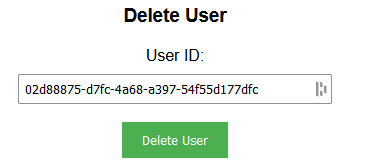

## Prerequisites

- Node package manager (npm).

> 📘 Note
> 
> You can download npm [here](https://nodejs.org/en/download).

## Nomad SDK NPM

To learn how to download and setup the nomad sdk npm, go to [Nomad SDK NPM](https://github.com/Nomad-Media/nomad-sdk/tree/main/nomad-sdk-npm).

## Setup

To run the Node application, follow these steps:
```
npm install
npm start
```

Then open a webpage and go to localhost:4200.

## Nomad SDK Files

In the nomad-sdk/js directory there are two versions of the Nomad SDK. There is the sdk.min.js file which is a minified version of the sdk, and the sdk-debug.js file which is a concatenated version of the sdk. The sdk-debug file will show you all the parameter documentation and readable code.

## Create User

To create a user, enter the email of the user you want to create. Then enter the properties of the user you want to create. Then click the `Create User` button.



> 📘 Note
>
> For more information about the API call used, go to [Create Content](https://developer.nomad-cms.com/docs/create-content)

## Get User

To get a user, enter the id of the user you want to get. Then click the `Get User` button.



> 📘 Note
>
> For more information about the API call used, go to [Get Content](https://developer.nomad-cms.com/docs/get-content)

## Update User

To update a user, enter the id of the user you want to update. Then enter the properties of the user you want to update. Then click the `Update User` button.



> 📘 Note
>
> For more information about the API call used, go to [Update Content](https://developer.nomad-cms.com/docs/update-content)

## Delete User

To delete a user, enter the id of the user you want to delete. Then click the `Delete User` button.



> 📘 Note
>
> For more information about the API call used, go to [Delete Content](https://developer.nomad-cms.com/docs/delete-content)