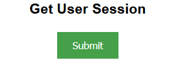
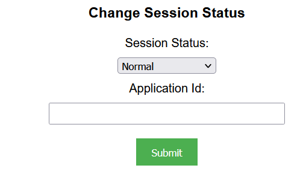

## Prerequisites

- Node package manager (npm).

> 📘 Note
> 
> You can download npm [here](https://nodejs.org/en/download).

## Nomad SDK NPM

To learn how to set up the nomad sdk npm, go to [Nomad SDK NPM](doc:nomad-sdk).

## Setup

To run the Node application, follow these steps:
```
npm install
npm start
```

Then open a webpage and go to localhost:4200.

## Nomad SDK Files

In the nomad-sdk/js directory there are two versions of the Nomad SDK. There is the sdk.min.js file which is a minified version of the sdk, and the sdk-debug.js file which is a concatenated version of the sdk. The sdk-debug file will show you all the parameter documentation and readable code.

## Get User Session

To get the user session, click submit under Get User Session.



> 📘 Note
> 
> For more information about the API call used go to [Gets a user session.](ref:getusersession)

## Change Session Status

To change the user session status, select what you want to change the status to. Optionally, enter the id of the application of the user.



> 📘 Note
> 
> For more information about the API call used go to [Changes a session status.](ref:changesessionstatus)