## Prerequisites

- Node package manager (npm).

> 📘 Note
> 
> You can download npm [here](https://nodejs.org/en/download).

## Nomad SDK NPM

To learn how to set up the nomad sdk npm, go to [Nomad SDK NPM](doc:nomad-sdk).

## Setup

To run the Node application, follow these steps:
```
npm install
npm start
```

Then open a webpage and go to localhost:4200.


## Nomad SDK Files

In the nomad-sdk/js directory there are two versions of the Nomad SDK. There is the sdk.min.js file which is a minified version of the sdk, and the sdk-debug.js file which is a concatenated version of the sdk. The sdk-debug file will show you all the parameter documentation and readable code.

## Delete User

To delete a user, enter the id of the user you want to delete. If the user id is left blank, the current user's id will be used.

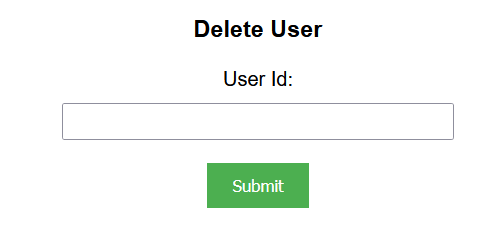

> 📘 Note
> 
> For more information about the API call used go to [Deletes a user.](ref:deleteuser)

## Delete User Data

To delete a user's data, enter the id of the user you want to delete the data of. If the user id is left blank, the current user's id will be used.

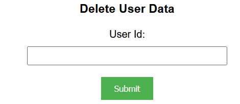

> 📘 Note
> 
> For more information about the API call used go to [Deletes a user's data.](ref:deleteuserdata)

## Delete User Content Attribute Data

To delete a user's content attribute data, enter the id of the user you want to delete the content attribute data of. If the user id is left blank, the current user's id will be used.

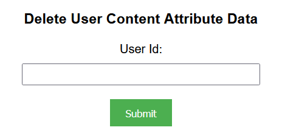

> 📘 Note
> 
> For more information about the API call used go to [Deletes a user's content attribute data.](ref:deleteusercontentattributedata)

## Delete User Content Group Data

To delete a user's content group data, enter the id of the user you want to delete the content group data of. If the user id is left blank, the current user's id will be used.

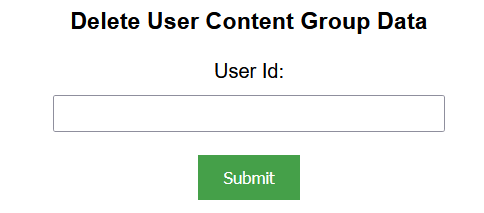

> 📘 Note
> 
> For more information about the API call used go to [Deletes a user's content group data.](ref:deleteusercontentgroupdata)

## Delete User Dislikes Data

To delete a user's dislikes data, enter the id of the user you want to delete the dislikes data of. If the user id is left blank, the current user's id will be used.

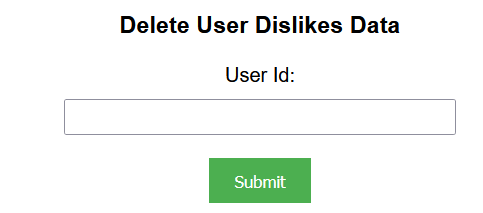

> 📘 Note
> 
> For more information about the API call used go to [Deletes a user's data.](ref:deleteuserdata)

## Delete User Likes Data

To delete a user's likes data, enter the id of the user you want to delete the likes data of. If the user id is left blank, the current user's id will be used.

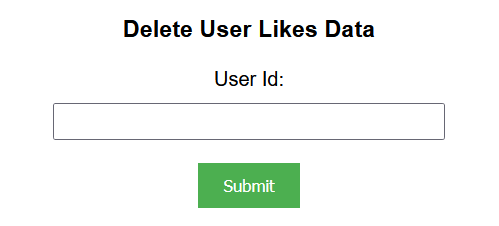

> 📘 Note
> 
> For more information about the API call used go to [Deletes a user's likes data](ref:delete_admin-user-like-userid)

## Delete User Favorites Data

To delete a user's favorites data, enter the id of the user you want to delete the favorites data of. If the user id is left blank, the current user's id will be used.

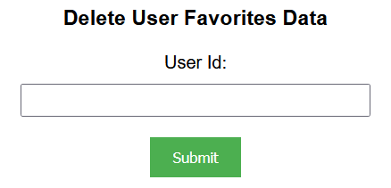

> 📘 Note
> 
> For more information about the API call used go to [Deletes a user's favorites data](ref:delete_admin-user-favorite-userid)

## Delete User Saved Search Data

To delete a user's saved search data, enter the id of the user you want to delete the saved search data of. If the user id is left blank, the current user's id will be used.

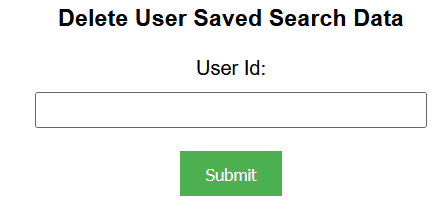

> 📘 Note
> 
> For more information about the API call used go to [Deletes a user's saved search data.](ref:deleteusersavedsearchdata)

## Delete User Session Data

To delete a user's session data, enter the id of the user you want to delete the session data of. If the user id is left blank, the current user's id will be used.

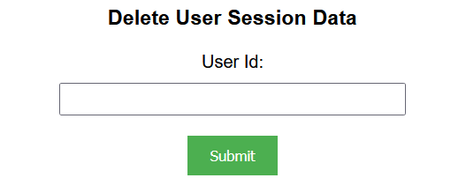

> 📘 Note
> 
> For more information about the API call used go to [Deletes a user's session data.](ref:deleteusersessiondata)

## Delete User Content Security Data

To delete a user's content security data, enter the information in the form below.

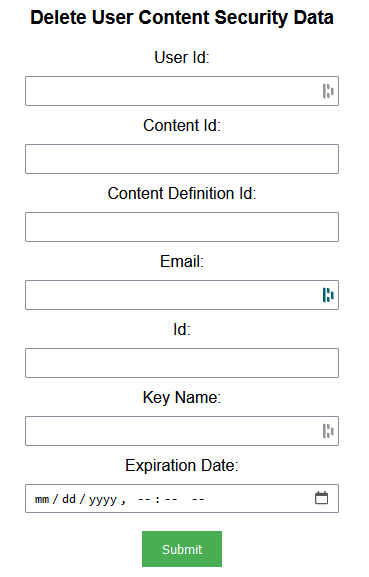

> 📘 Note
> 
> For more information about the API call used go to [Deletes a user's content security data.](ref:deleteusercontentsecuritydata)

## Delete User Video Tracking Data

To delete a user's video tracking data, enter the information in the form below.

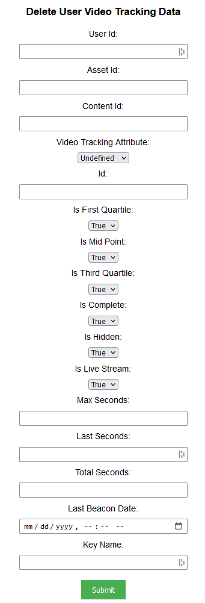

> 📘 Note
> 
> For more information about the API call used go to [Deletes a user's video tracking data.](ref:deleteuservideotrackingdata)