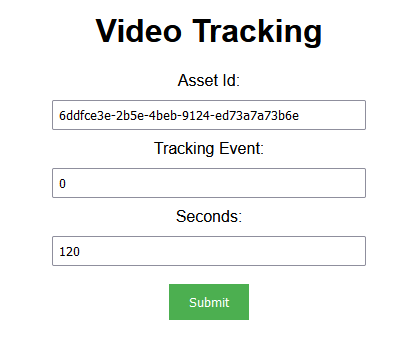
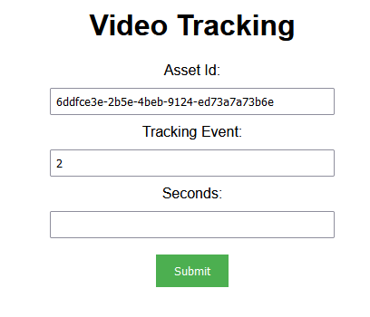
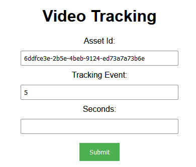

## Prerequisites

- Node package manager (npm).

> 📘 Note
> 
> You can download npm [here](https://nodejs.org/en/download).

## Nomad SDK NPM

To learn how to set up the nomad sdk npm, go to [Nomad SDK NPM](doc:nomad-sdk).

## Setup

To run the Node application, follow these steps:
```
npm install
npm start
```

Then open a webpage and go to localhost:4200.


## Nomad SDK Files

In the nomad-sdk/js directory there are two versions of the Nomad SDK. There is the sdk.min.js file which is a minified version of the sdk, and the sdk-debug.js file which is a concatenated version of the sdk. The sdk-debug file will show you all the parameter documentation and readable code.

## Video Tracking Seconds

To send the tracking data for the current seconds in the video player, enter the asset id for the video the user is watching you want to track, 0 for the tracking event and 120 for the seconds which is used for how often to send the video beacon progress tracking data.



## Video Tracking Quartile

To send the tracking data for the quartile in the video player for the current asset the user is watching, enter the asset id of the video the user is watching, the quartile you want to track under tracking events, and leave seconds blank.



## Video Tracking Hidden

To hide a user's video tracking data, enter the asset id for the video they want removed from their watch-list, and 5 for the tracking event.



> 📘 Note
> 
> For more information about the API call used got to [Video Tracking Service API](doc:video-tracking-service-api)